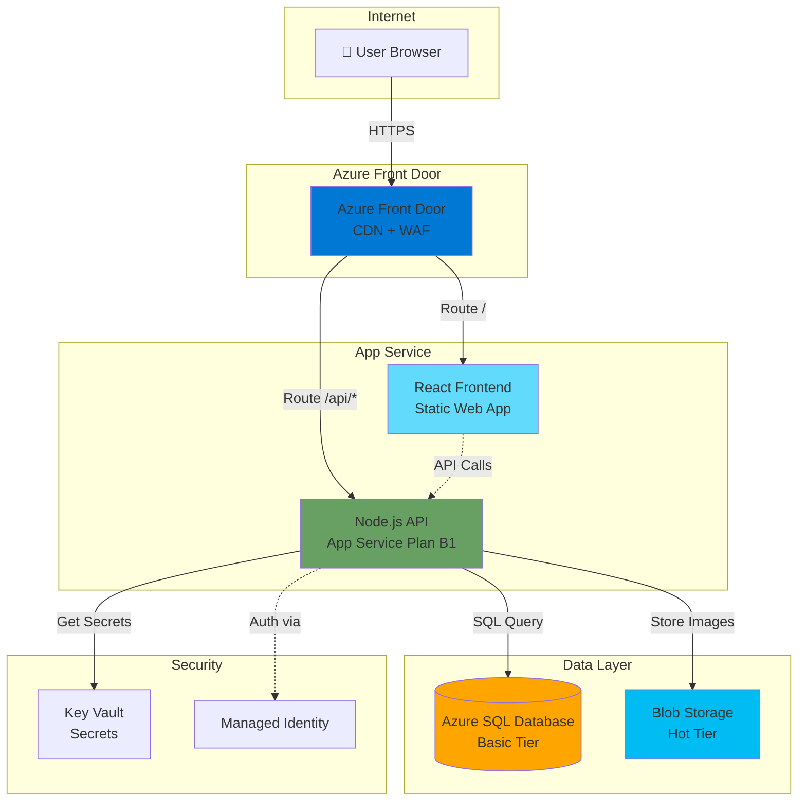

# Architecture 1: Simple 3-Tier Web Application

## Use Case
**Ứng dụng blog cá nhân hoặc website công ty nhỏ**
- 1,000 - 10,000 người dùng/tháng
- Nội dung tĩnh + động (bài viết, hình ảnh)
- Admin panel để quản lý nội dung
- Không cần xử lý real-time phức tạp

---

## Architecture Diagram



---

## Chi tiết Setup & Configuration

### 1. Frontend (Static Web App)
**SKU**: Free (đủ dùng cho traffic nhỏ)

**Cấu hình:**
```bash
# Deploy React app
az staticwebapp create \
  --name my-blog-frontend \
  --resource-group rg-blog \
  --source https://github.com/user/blog-frontend \
  --location eastasia \
  --branch main \
  --app-location "/src" \
  --output-location "/build"
```

**Đặc điểm:**
- Tự động CI/CD từ GitHub
- Built-in SSL certificate
- Global CDN miễn phí

---

### 2. Backend API (App Service)
**SKU**: B1 (Basic) - ~$13/tháng
- 1 Core CPU
- 1.75 GB RAM
- Đủ cho 10,000 requests/ngày

**Cấu hình App Service Plan:**
```bash
# Tạo App Service Plan
az appservice plan create \
  --name asp-blog-api \
  --resource-group rg-blog \
  --sku B1 \
  --is-linux

# Tạo Web App
az webapp create \
  --name blog-api-prod \
  --plan asp-blog-api \
  --resource-group rg-blog \
  --runtime "NODE:18-lts"
```

**Application Settings (Environment Variables):**
```json
{
  "DB_CONNECTION_STRING": "@Microsoft.KeyVault(SecretUri=https://kv-blog.vault.azure.net/secrets/db-connection)",
  "BLOB_STORAGE_URL": "https://blogimages.blob.core.windows.net",
  "NODE_ENV": "production"
}
```

**Managed Identity Configuration:**
```bash
# Bật System-assigned Managed Identity
az webapp identity assign \
  --name blog-api-prod \
  --resource-group rg-blog

# Cấp quyền cho Key Vault
az keyvault set-policy \
  --name kv-blog \
  --object-id <MANAGED_IDENTITY_ID> \
  --secret-permissions get list
```

---

### 3. Database (Azure SQL Database)
**SKU**: Basic (5 DTU) - ~$5/tháng
- 2GB storage
- Phù hợp cho < 100 concurrent connections

**Cấu hình:**
```bash
# Tạo SQL Server
az sql server create \
  --name sqlserver-blog-prod \
  --resource-group rg-blog \
  --location eastasia \
  --admin-user sqladmin \
  --admin-password <STRONG_PASSWORD>

# Tạo Database
az sql db create \
  --name blogdb \
  --server sqlserver-blog-prod \
  --resource-group rg-blog \
  --service-objective Basic
```

**Firewall Rules:**
```bash
# Cho phép Azure Services truy cập
az sql server firewall-rule create \
  --server sqlserver-blog-prod \
  --resource-group rg-blog \
  --name AllowAzureServices \
  --start-ip-address 0.0.0.0 \
  --end-ip-address 0.0.0.0
```

**Connection String (lưu trong Key Vault):**
```
Server=tcp:sqlserver-blog-prod.database.windows.net,1433;Database=blogdb;Authentication=Active Directory Managed Identity;
```

---

### 4. Blob Storage (Lưu hình ảnh)
**SKU**: Standard LRS (Locally Redundant Storage)
- Hot Access Tier cho ảnh thường xuyên truy cập

**Cấu hình:**
```bash
# Tạo Storage Account
az storage account create \
  --name blogimages \
  --resource-group rg-blog \
  --location eastasia \
  --sku Standard_LRS \
  --kind StorageV2 \
  --access-tier Hot

# Tạo Container
az storage container create \
  --name images \
  --account-name blogimages \
  --public-access blob
```

**CORS Configuration (cho phép upload từ Frontend):**
```json
{
  "allowedOrigins": ["https://my-blog-frontend.azurestaticapps.net"],
  "allowedMethods": ["GET", "PUT", "POST"],
  "maxAgeInSeconds": 3600,
  "exposedHeaders": ["*"],
  "allowedHeaders": ["*"]
}
```

---

### 5. Azure Front Door (Optional - nâng cao)
**SKU**: Standard (~$35/tháng)

**Lợi ích:**
- WAF (Web Application Firewall) chống DDoS
- Global routing thông minh
- Cache tĩnh ở Edge

**Cấu hính Routes:**
```yaml
Routes:
  - Path: "/"
    Origin: Static Web App (Frontend)
    Cache: 1 hour
  
  - Path: "/api/*"
    Origin: App Service (Backend)
    Cache: None (Dynamic content)
```

---

## Scaling Strategy

### Khi nào cần scale?

**Metrics cần theo dõi (Azure Monitor):**
- CPU Usage > 70% liên tục → Scale Up hoặc Scale Out
- Response Time > 2s → Kiểm tra slow query hoặc scale Backend
- DTU Usage (SQL) > 80% → Nâng tier lên S0 (10 DTU)

### Auto-scaling cho App Service:
```bash
# Tạo rule auto-scale
az monitor autoscale create \
  --resource-group rg-blog \
  --resource blog-api-prod \
  --resource-type Microsoft.Web/serverfarms \
  --name autoscale-blog-api \
  --min-count 1 \
  --max-count 3 \
  --count 1

# Rule: Scale out khi CPU > 75%
az monitor autoscale rule create \
  --resource-group rg-blog \
  --autoscale-name autoscale-blog-api \
  --condition "Percentage CPU > 75 avg 5m" \
  --scale out 1
```

---

## Chi phí ước tính (Monthly)

| Service | SKU | Giá |
|---------|-----|-----|
| Static Web App | Free | $0 |
| App Service Plan | B1 | $13 |
| Azure SQL Database | Basic | $5 |
| Blob Storage | 10GB LRS Hot | $0.20 |
| Key Vault | Standard | $0.03 |
| **TỔNG** | | **~$18.23/tháng** |

---

## Security Best Practices

✅ **Đã áp dụng:**
- Managed Identity (không hardcode password)
- Key Vault cho secrets
- HTTPS enforced
- SQL Firewall rules

🔒 **Khuyến nghị thêm:**
- Bật **Azure SQL Advanced Threat Protection**
- Cấu hình **Private Endpoint** nếu cần bảo mật cao hơn (SQL không public)
- Dùng **Azure Front Door WAF** để chống SQL Injection, XSS
