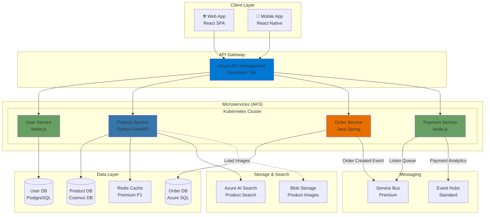

# Architecture 2: Microservices E-commerce Platform

## Use Case
**Nền tảng thương mại điện tử vừa và nhỏ**
- 50,000 - 200,000 người dùng/tháng
- Xử lý thanh toán, quản lý đơn hàng, inventory
- Cần tách biệt services để scale độc lập
- Load spike trong flash sale

---

## Architecture Diagram



---

## Chi tiết Setup & Configuration

### 1. Azure Kubernetes Service (AKS)
**SKU**: Standard_D2s_v3 (2 vCPU, 8GB RAM) x 3 nodes
- **Node Pool**: System (1 node) + User (2-5 nodes với auto-scale)

**Tạo AKS Cluster:**
```bash
# Tạo AKS với auto-scaling
az aks create \
  --resource-group rg-ecommerce \
  --name aks-ecommerce-prod \
  --node-count 2 \
  --node-vm-size Standard_D2s_v3 \
  --enable-addons monitoring \
  --enable-cluster-autoscaler \
  --min-count 2 \
  --max-count 5 \
  --load-balancer-sku standard \
  --network-plugin azure \
  --enable-managed-identity
```

**Horizontal Pod Autoscaler (HPA) - User Service:**
```yaml
apiVersion: autoscaling/v2
kind: HorizontalPodAutoscaler
metadata:
  name: user-service-hpa
spec:
  scaleTargetRef:
    apiVersion: apps/v1
    kind: Deployment
    name: user-service
  minReplicas: 2
  maxReplicas: 10
  metrics:
  - type: Resource
    resource:
      name: cpu
      target:
        type: Utilization
        averageUtilization: 70
  - type: Resource
    resource:
      name: memory
      target:
        type: Utilization
        averageUtilization: 80
```

**Service Deployment - Product Service (Python FastAPI):**
```yaml
apiVersion: apps/v1
kind: Deployment
metadata:
  name: product-service
spec:
  replicas: 3
  selector:
    matchLabels:
      app: product-service
  template:
    metadata:
      labels:
        app: product-service
    spec:
      containers:
      - name: product-api
        image: ecommerceacr.azurecr.io/product-service:v1.2.0
        ports:
        - containerPort: 8000
        env:
        - name: COSMOS_DB_ENDPOINT
          valueFrom:
            secretKeyRef:
              name: product-secrets
              key: cosmos-endpoint
        - name: REDIS_HOST
          value: "ecommerce-redis.redis.cache.windows.net"
        resources:
          requests:
            cpu: 250m
            memory: 512Mi
          limits:
            cpu: 500m
            memory: 1Gi
        livenessProbe:
          httpGet:
            path: /health
            port: 8000
          initialDelaySeconds: 30
          periodSeconds: 10
        readinessProbe:
          httpGet:
            path: /ready
            port: 8000
          initialDelaySeconds: 5
          periodSeconds: 5
---
apiVersion: v1
kind: Service
metadata:
  name: product-service
spec:
  type: ClusterIP
  ports:
  - port: 80
    targetPort: 8000
  selector:
    app: product-service
```

---

### 2. Azure API Management (APIM)
**SKU**: Developer ($50/tháng) → Production nên dùng **Standard** ($680/tháng)

**Lợi ích:**
- Rate limiting (giới hạn 1000 requests/phút/user)
- JWT token validation
- Response caching
- API versioning

**Policy Configuration:**
```xml
<policies>
    <inbound>
        <!-- Validate JWT Token -->
        <validate-jwt header-name="Authorization" failed-validation-httpcode="401">
            <openid-config url="https://login.microsoftonline.com/{tenant}/.well-known/openid-configuration" />
            <audiences>
                <audience>api://ecommerce-api</audience>
            </audiences>
        </validate-jwt>
        
        <!-- Rate Limiting -->
        <rate-limit-by-key calls="1000" renewal-period="60" counter-key="@(context.Request.IpAddress)" />
        
        <!-- Cache GET requests -->
        <cache-lookup vary-by-developer="false" vary-by-developer-groups="false">
            <vary-by-query-parameter>category</vary-by-query-parameter>
        </cache-lookup>
    </inbound>
    
    <backend>
        <forward-request />
    </backend>
    
    <outbound>
        <!-- Cache response for 5 minutes -->
        <cache-store duration="300" />
    </outbound>
</policies>
```

**Backend Configuration (AKS Integration):**
```bash
# Lấy Internal Load Balancer IP của AKS
kubectl get svc product-service -o jsonpath='{.status.loadBalancer.ingress[0].ip}'

# Trong APIM, add Backend:
# Name: product-service-backend
# URL: http://10.240.0.10/api/v1/products
```

---

### 3. Databases

#### A. User DB (Azure Database for PostgreSQL)
**SKU**: General Purpose, 2 vCores (~$145/tháng)

```bash
az postgres flexible-server create \
  --name postgres-ecommerce-users \
  --resource-group rg-ecommerce \
  --location eastasia \
  --admin-user adminuser \
  --admin-password <PASSWORD> \
  --sku-name Standard_D2s_v3 \
  --tier GeneralPurpose \
  --version 14 \
  --storage-size 128 \
  --high-availability Disabled
```

**Connection Pooling (PgBouncer):**
```ini
# Trong AKS, deploy PgBouncer sidecar
[databases]
userdb = host=postgres-ecommerce-users.postgres.database.azure.net port=5432 dbname=users

[pgbouncer]
pool_mode = transaction
max_client_conn = 1000
default_pool_size = 25
```

---

#### B. Product DB (Cosmos DB)
**SKU**: Standard, Autoscale (400 - 4000 RU/s)

**Tại sao dùng Cosmos DB?**
- Scale globally (replica ở nhiều region)
- Low latency (<10ms read)
- Schema flexible (sản phẩm có nhiều thuộc tính khác nhau)

```bash
# Tạo Cosmos DB Account
az cosmosdb create \
  --name cosmos-ecommerce-products \
  --resource-group rg-ecommerce \
  --default-consistency-level Session \
  --locations regionName=eastasia failoverPriority=0 \
  --enable-automatic-failover

# Tạo Database và Container
az cosmosdb sql database create \
  --account-name cosmos-ecommerce-products \
  --name ProductsDB \
  --resource-group rg-ecommerce

az cosmosdb sql container create \
  --account-name cosmos-ecommerce-products \
  --database-name ProductsDB \
  --name Products \
  --partition-key-path "/category" \
  --throughput 400 \
  --max-throughput 4000 \
  --autoscale
```

**Indexing Policy (Optimize Query):**
```json
{
  "indexingMode": "consistent",
  "automatic": true,
  "includedPaths": [
    {"path": "/name/?"},
    {"path": "/category/?"},
    {"path": "/price/?"}
  ],
  "excludedPaths": [
    {"path": "/description/*"},
    {"path": "/_etag/?"}
  ]
}
```

---

#### C. Order DB (Azure SQL Database)
**SKU**: Standard S2 (50 DTU) - ~$75/tháng

**Tại sao Azure SQL?**
- ACID Transaction (quan trọng cho order)
- Complex query (JOIN giữa Order, OrderItems, Payments)

```bash
az sql db create \
  --name orderdb \
  --server sqlserver-ecommerce \
  --resource-group rg-ecommerce \
  --service-objective S2 \
  --zone-redundant false
```

**Read Replica cho Reporting:**
```bash
# Tạo Read-only replica
az sql db replica create \
  --name orderdb-readonly \
  --server sqlserver-ecommerce-readonly \
  --resource-group rg-ecommerce \
  --source-database orderdb \
  --source-server sqlserver-ecommerce
```

---

### 4. Azure Cache for Redis
**SKU**: Premium P1 (6GB) - ~$260/tháng

**Use cases:**
- Session storage
- Product catalog cache
- Shopping cart data

```bash
az redis create \
  --name ecommerce-redis \
  --resource-group rg-ecommerce \
  --location eastasia \
  --sku Premium \
  --vm-size P1 \
  --enable-non-ssl-port false
```

**Cache Strategy trong Product Service:**
```python
# Python FastAPI example
@app.get("/products/{product_id}")
async def get_product(product_id: str):
    # Check cache first
    cached = await redis.get(f"product:{product_id}")
    if cached:
        return json.loads(cached)
    
    # Cache miss -> Query Cosmos DB
    product = await cosmos_client.read_item(product_id, partition_key=category)
    
    # Store in cache (TTL = 1 hour)
    await redis.setex(f"product:{product_id}", 3600, json.dumps(product))
    
    return product
```

---

### 5. Service Bus (Message Queue)
**SKU**: Premium (1 Messaging Unit) - ~$677/tháng

**Queue configuration:**
```bash
# Tạo namespace
az servicebus namespace create \
  --name sb-ecommerce-prod \
  --resource-group rg-ecommerce \
  --sku Premium \
  --capacity 1

# Queue: Order Processing
az servicebus queue create \
  --namespace-name sb-ecommerce-prod \
  --name order-created \
  --resource-group rg-ecommerce \
  --max-delivery-count 5 \
  --lock-duration PT5M
```

**Message Flow:**
1. Order Service gửi message "OrderCreated" vào queue
2. Payment Service lắng nghe queue, xử lý payment
3. Nếu fail → retry 5 lần → chuyển vào Dead Letter Queue

**Code example (Order Service - Sender):**
```javascript
// Node.js
const { ServiceBusClient } = require("@azure/service-bus");

async function sendOrderMessage(orderData) {
  const sbClient = new ServiceBusClient(connectionString);
  const sender = sbClient.createSender("order-created");
  
  await sender.sendMessages({
    body: orderData,
    contentType: "application/json",
    messageId: orderData.orderId
  });
  
  await sender.close();
}
```

---

## Scaling Strategy

### 1. AKS Node Auto-scaling
```bash
# Đã bật khi tạo cluster: --enable-cluster-autoscaler
# Scale từ 2 → 5 nodes khi CPU cluster > 70%
```

### 2. HPA (Horizontal Pod Autoscaler)
- User Service: 2-10 pods
- Product Service: 3-15 pods (traffic cao nhất)
- Order Service: 2-8 pods
- Payment Service: 2-6 pods

### 3. Database Scaling
**Cosmos DB**: Autoscale 400 → 4000 RU/s
**Azure SQL**: Manual scale từ S2 (50 DTU) → S3 (100 DTU) khi cần

---

## Chi phí ước tính (Monthly)

| Service | SKU | Giá |
|---------|-----|-----|
| AKS (3 nodes D2s_v3) | Standard | $228 |
| APIM | Developer | $50 |
| PostgreSQL | GP 2vCore | $145 |
| Cosmos DB | 1000 RU/s avg | $58 |
| Azure SQL | Standard S2 | $75 |
| Redis Cache | Premium P1 | $260 |
| Service Bus | Premium 1MU | $677 |
| Blob Storage | 100GB | $2 |
| Azure AI Search | Basic | $75 |
| **TỔNG** | | **~$1,570/tháng** |

---

## Communication Security

### 1. mTLS (Mutual TLS) giữa Services
Dùng **Service Mesh (Linkerd hoặc Istio)**:
```bash
# Install Linkerd
linkerd install | kubectl apply -f -

# Inject sidecar vào namespace
kubectl annotate namespace default linkerd.io/inject=enabled
```

### 2. Managed Identity cho AKS
```bash
# AKS pod lấy secret từ Key Vault
az aks enable-addons \
  --addons azure-keyvault-secrets-provider \
  --name aks-ecommerce-prod \
  --resource-group rg-ecommerce
```

---

## Monitoring & Observability

**Azure Monitor + Application Insights:**
```bash
# Enable Container Insights
az aks enable-addons \
  --addons monitoring \
  --name aks-ecommerce-prod \
  --resource-group rg-ecommerce \
  --workspace-resource-id <LOG_ANALYTICS_ID>
```

**Key Metrics:**
- Request latency P95 < 200ms
- Error rate < 0.1%
- Pod CPU < 70%
- Database DTU < 80%
