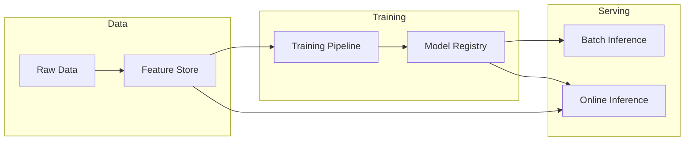
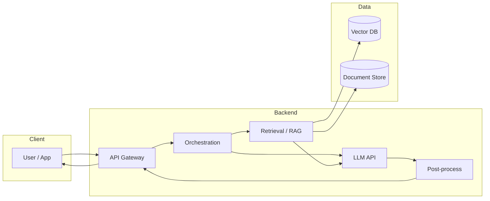

# AI Backend System Design – ML/DL vs LLM Application

Tài liệu so sánh **system design** cho hai hướng backend AI thường gặp:

1. **Backend AI/ML/DL** – Hệ thống machine learning / deep learning: training pipeline, model serving, inference (batch + real-time).
2. **Backend AI Application (LLM via API)** – Ứng dụng gọi LLM qua API: RAG, agent, orchestration, không tự train model.

---

## 1. So sánh nhanh hai loại

| Khía cạnh | Backend ML/DL | Backend AI Application (LLM API) |
|-----------|----------------|----------------------------------|
| **Mục đích** | Train và serve model riêng (classification, regression, CV, NLP custom…) | Ứng dụng dùng LLM có sẵn (OpenAI, Azure OpenAI…) qua API |
| **Model** | Tự train / fine-tune; version model, artifact | Gọi API bên ngoài; ít hoặc không quản lý model |
| **Latency** | Cần tối ưu (sub-100ms cho real-time) | Thường 1–10s; có streaming, cache để giảm cảm nhận latency |
| **Data** | Feature store, training data, label | Vector DB (embedding), document store cho RAG |
| **Pipeline** | Data → Training → Registry → Serving | Query → Retrieval → LLM → Post-process → Response |
| **Cost** | GPU/TPU training + inference; scaling theo throughput | Token cost (API) + embedding + vector DB; scaling theo request |

---

## 2. System Design – Backend ML/DL (Training + Inference)

### 2.1 Tổng quan kiến trúc

Hệ thống ML/DL production thường gồm: **data pipeline** → **training pipeline** → **model registry** → **serving (inference)**. Model code thường chỉ chiếm ~5% codebase; phần còn lại là data, feature, config, monitoring, serving.

### 2.2 Các thành phần chính

| Thành phần | Vai trò | Công nghệ thường dùng |
|------------|---------|------------------------|
| **Data pipeline** | Thu thập, validate, transform; feed vào training và serving | Spark, Airflow, dbt; Data Lake / Warehouse |
| **Feature Store** | Lưu feature dùng chung cho training và inference; serve feature real-time (<100ms p99) | Feast, Tecton; Redis/DynamoDB làm online store |
| **Training pipeline** | Train / fine-tune model; hyperparameter tuning; output artifact | Kubeflow, SageMaker Pipelines, Vertex AI, MLflow |
| **Model Registry** | Version model, metadata, approval, promote staging → prod | MLflow, SageMaker Model Registry, Vertex AI Model Registry |
| **Serving – Batch** | Chạy inference theo lô (hourly/daily); ghi kết quả DB | Spark, SageMaker Batch, Azure ML Batch |
| **Serving – Online** | Inference real-time (API request → response) | TensorFlow Serving, Triton, KServe, SageMaker Endpoint, Azure ML Online Endpoint |

### 2.3 Batch vs Online Inference

| | Batch Inference | Online (Real-time) Inference |
|--|-----------------|------------------------------|
| **Latency** | Giờ / ngày (schedule) | Sub-100ms – vài trăm ms (p99) |
| **Use case** | Lead scoring, report, recommendation precompute | Fraud detection, personalization real-time, search ranking |
| **Infra** | Spark, batch job, queue | Model server, autoscaling, GPU/CPU |
| **Feature** | Feature từ batch pipeline / warehouse | Feature từ **Feature Store** (online) để đảm bảo low latency |

### 2.4 MLOps & reliability

- **CI/CD**: Build image, chạy test, deploy pipeline và model (canary, blue-green).
- **Monitoring**: Data drift, feature skew, model performance (accuracy, latency), SLA.
- **Retraining**: Trigger theo schedule, data availability, hoặc khi metric tụt (drift, A/B test).
- **Rollback**: Version model trong registry; rollback endpoint về version cũ.

**Lưu ý production:** Tách rõ **training** (GPU, batch, đắt) và **serving** (latency, scaling); Feature Store giúp training và serving dùng chung feature, tránh training-serving skew.

---

## 3. System Design – Backend AI Application (LLM via API)

### 3.1 Tổng quan kiến trúc

Ứng dụng gọi LLM qua API: **orchestration** (request routing, tool/agent) → **retrieval** (RAG: embedding + vector DB) → **LLM call** → **post-process** (format, filter, audit) → **response**. Không tự train LLM; tối ưu latency, cost, và độ tin cậy (grounding, safety).

### 3.2 Các thành phần chính

| Thành phần | Vai trò | Công nghệ thường dùng |
|------------|---------|------------------------|
| **API Gateway** | Auth, rate limit, routing, logging | Kong, APIM, AWS API Gateway, Azure API Management |
| **Orchestration** | Điều phối luồng: RAG, tool call, multi-step (agent); retry, timeout | LangChain, LlamaIndex, Semantic Kernel, custom service |
| **Embedding** | Chuyển query/document thành vector | OpenAI Embedding, Azure OpenAI, Cohere, open-source (sentence-transformers) |
| **Vector DB** | Lưu embedding; search top-k theo similarity | Pinecone, Weaviate, Milvus, Azure AI Search, pgvector |
| **Document store** | Lưu văn bản gốc cho RAG (chunk, metadata) | Blob, Cosmos DB, Elasticsearch; thường đi kèm Vector DB |
| **LLM API** | Gọi model (chat, completion, embedding) | Azure OpenAI, OpenAI, Anthropic, open-source (vLLM, TGI) |
| **Post-process** | Format output, filter nội dung, audit log, guardrail | Custom service, Azure Content Safety, prompt filter |

### 3.3 Pattern thường dùng

**RAG (Retrieval-Augmented Generation)**  
- Query → embed → search vector DB (top-k) → lấy document → prompt = query + context → LLM → response.  
- Giảm hallucination; cập nhật knowledge qua document không cần retrain.

**Agent (Tool use, multi-step)**  
- User request → Orchestrator gọi LLM → LLM quyết định gọi tool (search, API, code) → thực thi tool → đưa kết quả lại LLM → lặp hoặc trả lời.  
- Cần: tool registry, execution sandbox, state giữa các bước, timeout/retry.

**Streaming**  
- Trả token từng phần từ LLM → client hiển thị dần; giảm cảm nhận latency.  
- Backend: SSE hoặc WebSocket; buffer và forward stream.

**Caching**  
- Cache response theo semantic key (tương tự query → trả lại cache).  
- Cache embedding, cache kết quả tool (agent); giảm cost và latency.

### 3.4 Production considerations

- **Latency**: LLM thường 1–10s; dùng streaming + cache + tối ưu prompt (ít token).  
- **Cost**: Token pricing; giảm context length, cache, model nhỏ hơn khi đủ dùng.  
- **Reliability**: Retry, fallback model, circuit breaker; rate limit phía nhà cung cấp.  
- **Safety**: Content filter, PII redaction, audit log; Responsible AI (blocklist, prompt shield).  
- **Observability**: Log prompt/response (mask PII), trace RAG/agent step, metric latency/cost/error.

**Lưu ý:** Backend LLM Application không cần pipeline training phức tạp; tập trung vào orchestration, retrieval, API design, và vận hành (monitor, cost, safety).

---

## 4. Khi nào dùng kiểu nào?

| Nhu cầu | Nên chọn |
|---------|----------|
| Custom model (vision, NLP riêng, recommendation model, fraud model…) | **Backend ML/DL** – training + inference pipeline, feature store, model registry. |
| Ứng dụng chat, Q&A, summarization, dựa trên tài liệu / knowledge base | **Backend LLM Application** – RAG + API LLM. |
| Tự động gọi API/tool, multi-step reasoning | **Backend LLM Application** – Agent + orchestration. |
| Latency rất thấp (sub-100ms), control full stack model | **Backend ML/DL** – online inference, feature store, model tối ưu. |
| Nhanh prototype, ít vận hành model | **Backend LLM Application** – gọi API, tập trung RAG/agent và product. |

---

## 5. Tài liệu tham khảo

- [ML System Design Guide](https://www.systemdesignhandbook.com/guides/ml-system-design/)
- [Production ML Systems (Google)](https://developers.google.com/machine-learning/crash-course/production-ml-systems)
- [LLM System Design Guide](https://www.systemdesignhandbook.com/guides/llm-system-design/)
- [Batch vs Online Inference](https://mlinproduction.com/batch-inference-vs-online-inference/)
- [Feast – Feature Store](https://docs.feast.dev/getting-started/architecture/overview)
- [Designing Production RAG](https://levelup.gitconnected.com/designing-a-production-grade-rag-architecture-bee5a4e4d9aa)
