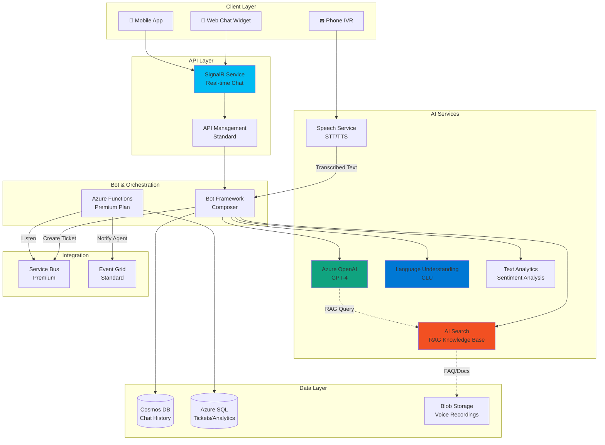

# Architecture 3: AI-Powered Customer Service System

## Use Case
**Hệ thống CSKH thông minh với AI**
- Chatbot 24/7 trả lời tự động
- Phân tích sentiment của khách hàng
- Tìm kiếm tài liệu support thông minh
- Escalate sang agent người thật khi cần
- Xử lý voice call (Speech-to-Text)

---

## Architecture Diagram



---

## Chi tiết Setup & Configuration

### 1. Azure OpenAI Service
**Model Deployment**: GPT-4 Turbo (128K context)

**Tạo Azure OpenAI:**
```bash
# Tạo resource (cần approval từ Microsoft)
az cognitiveservices account create \
  --name openai-customer-service \
  --resource-group rg-ai-support \
  --location eastus \
  --kind OpenAI \
  --sku S0

# Deploy GPT-4 model
az cognitiveservices account deployment create \
  --name openai-customer-service \
  --resource-group rg-ai-support \
  --deployment-name gpt4-turbo \
  --model-name gpt-4 \
  --model-version "turbo-2024-04-09" \
  --model-format OpenAI \
  --sku-capacity 10 \
  --sku-name "Standard"
```

**System Prompt cho Customer Service Bot:**
```python
SYSTEM_PROMPT = """
Bạn là trợ lý CSKH thân thiện và chuyên nghiệp của công ty XYZ.

NGUYÊN TẮC:
1. Luôn lịch sự, empathy với khách hàng
2. Chỉ trả lời dựa trên tài liệu được cung cấp (context)
3. Nếu không biết câu trả lời, thừa nhận và đề xuất chuyển sang agent người
4. Không bịa đặt thông tin
5. Hỏi làm rõ nếu câu hỏi không rõ ràng

FORMAT TRẢ LỜI:
- Ngắn gọn, súc tích
- Bullet points nếu có nhiều bước
- Kèm link tài liệu nếu có
"""
```

**Token Management & Cost Control:**
```python
# Giới hạn tokens để tránh chi phí cao
response = openai.ChatCompletion.create(
    model="gpt4-turbo",
    messages=[
        {"role": "system", "content": SYSTEM_PROMPT},
        {"role": "user", "content": user_message}
    ],
    max_tokens=500,  # Giới hạn output
    temperature=0.7,  # Vừa đủ creative
    presence_penalty=0.6,  # Tránh lặp lại
)
```

---

### 2. Azure AI Search (RAG - Knowledge Base)
**SKU**: Standard S1 (~$250/tháng)

**Tạo Search Service:**
```bash
az search service create \
  --name search-support-kb \
  --resource-group rg-ai-support \
  --sku Standard \
  --location eastasia \
  --partition-count 1 \
  --replica-count 2
```

**Indexer Pipeline (Tự động import docs):**
```json
{
  "name": "support-docs-indexer",
  "dataSourceName": "blob-support-docs",
  "targetIndexName": "support-knowledge-base",
  "skillsetName": "text-enrichment-skillset",
  "schedule": {
    "interval": "PT2H"  // Chạy mỗi 2 giờ
  },
  "parameters": {
    "configuration": {
      "dataToExtract": "contentAndMetadata",
      "parsingMode": "default"
    }
  }
}
```

**Skillset (Làm giàu dữ liệu bằng AI):**
```json
{
  "name": "text-enrichment-skillset",
  "skills": [
    {
      "@odata.type": "#Microsoft.Skills.Vision.OcrSkill",
      "context": "/document/normalized_images/*",
      "defaultLanguageCode": "vi",
      "detectOrientation": true
    },
    {
      "@odata.type": "#Microsoft.Skills.Text.MergeSkill",
      "context": "/document",
      "insertPreTag": " ",
      "insertPostTag": " "
    },
    {
      "@odata.type": "#Microsoft.Skills.Text.SplitSkill",
      "context": "/document/merged_content",
      "textSplitMode": "pages",
      "maximumPageLength": 2000,
      "pageOverlapLength": 500
    },
    {
      "@odata.type": "#Microsoft.Skills.Text.AzureOpenAIEmbeddingSkill",
      "context": "/document/pages/*",
      "resourceUri": "https://openai-customer-service.openai.azure.com",
      "deploymentId": "text-embedding-ada-002",
      "modelName": "text-embedding-ada-002"
    }
  ]
}
```

**Vector Search Configuration (Semantic Search):**
```json
{
  "name": "support-knowledge-base",
  "fields": [
    {"name": "id", "type": "Edm.String", "key": true},
    {"name": "title", "type": "Edm.String", "searchable": true},
    {"name": "content", "type": "Edm.String", "searchable": true},
    {"name": "contentVector", "type": "Collection(Edm.Single)", "dimensions": 1536, "vectorSearchProfile": "my-vector-profile"}
  ],
  "vectorSearch": {
    "algorithms": [
      {
        "name": "my-hnsw-algorithm",
        "kind": "hnsw",
        "hnswParameters": {
          "metric": "cosine",
          "m": 4,
          "efConstruction": 400,
          "efSearch": 500
        }
      }
    ],
    "profiles": [
      {
        "name": "my-vector-profile",
        "algorithm": "my-hnsw-algorithm"
      }
    ]
  }
}
```

**RAG Implementation - Retrieve & Generate:**
```python
async def answer_question(user_question: str, chat_history: list):
    # 1. Vector Search: Tìm tài liệu liên quan
    search_results = await search_client.search(
        search_text=user_question,
        vector_queries=[VectorizedQuery(
            vector=get_embedding(user_question),
            k_nearest_neighbors=5,
            fields="contentVector"
        )],
        select=["title", "content"],
        top=3
    )
    
    # 2. Build context từ search results
    context = "\n\n".join([
        f"[{doc['title']}]\n{doc['content']}" 
        for doc in search_results
    ])
    
    # 3. Gửi vào GPT-4 với context
    messages = [
        {"role": "system", "content": SYSTEM_PROMPT},
        {"role": "system", "content": f"KNOWLEDGE BASE:\n{context}"},
        *chat_history,  # Previous conversation
        {"role": "user", "content": user_question}
    ]
    
    response = await openai_client.chat.completions.create(
        model="gpt4-turbo",
        messages=messages,
        temperature=0.7,
        max_tokens=500
    )
    
    return response.choices[0].message.content
```

---

### 3. Conversational Language Understanding (CLU)
**Use case**: Phân loại intent và extract entities

**Training Data Example:**
```json
{
  "projectKind": "Conversation",
  "utterances": [
    {
      "text": "Tôi muốn hủy đơn hàng #12345",
      "intent": "CancelOrder",
      "entities": [
        {"category": "OrderNumber", "offset": 22, "length": 6, "text": "12345"}
      ]
    },
    {
      "text": "Kiểm tra trạng thái đơn",
      "intent": "CheckOrderStatus",
      "entities": []
    },
    {
      "text": "Tôi cần nói chuyện với người thật",
      "intent": "EscalateToAgent",
      "entities": []
    }
  ]
}
```

**Deploy & Use:**
```python
from azure.ai.language.conversations import ConversationAnalysisClient

clu_client = ConversationAnalysisClient(endpoint, credential)

async def classify_intent(user_message: str):
    result = await clu_client.analyze_conversation(
        task={
            "kind": "Conversation",
            "analysisInput": {
                "conversationItem": {
                    "text": user_message,
                    "id": "1",
                    "participantId": "user"
                }
            },
            "parameters": {
                "projectName": "customer-service-bot",
                "deploymentName": "production"
            }
        }
    )
    
    top_intent = result["prediction"]["topIntent"]
    confidence = result["prediction"]["intents"][0]["confidence"]
    entities = result["prediction"]["entities"]
    
    # Logic: Nếu intent rõ ràng (confidence > 0.8), bypass GPT để tiết kiệm
    if confidence > 0.8 and top_intent == "CheckOrderStatus":
        order_number = entities[0]["text"]
        return await get_order_status(order_number)  # Direct DB query
    else:
        # Gửi vào GPT-4 để xử lý phức tạp
        return await answer_question(user_message)
```

---

### 4. Azure AI Text Analytics (Sentiment Analysis)
**Use case**: Phát hiện khách hàng tức giận → Escalate ngay

```python
from azure.ai.textanalytics import TextAnalyticsClient

async def analyze_sentiment(text: str):
    result = text_analytics_client.analyze_sentiment([text])[0]
    
    sentiment = result.sentiment  # positive, negative, neutral
    confidence_scores = result.confidence_scores
    
    # Nếu negative với confidence cao → chuyển agent
    if sentiment == "negative" and confidence_scores.negative > 0.8:
        await escalate_to_human_agent({
            "reason": "Negative sentiment detected",
            "sentiment_score": confidence_scores.negative,
            "message": text
        })
        return "Chúng tôi rất xin lỗi! Tôi đang kết nối bạn với chuyên viên hỗ trợ..."
    
    return None
```

---

### 5. Azure SignalR Service (Real-time Chat)
**SKU**: Standard S1 (1000 concurrent connections) - ~$50/tháng

**Tạo SignalR:**
```bash
az signalr create \
  --name signalr-customer-chat \
  --resource-group rg-ai-support \
  --sku Standard_S1 \
  --unit-count 1 \
  --service-mode Serverless  # Dùng với Azure Functions
```

**Azure Functions - SignalR Hub:**
```javascript
// negotiate function (client lấy connection info)
module.exports = async function (context, req) {
    context.res = {
        body: context.bindings.signalRConnectionInfo
    };
};

// broadcast function (gửi message real-time)
module.exports = async function (context, req) {
    const message = req.body.message;
    const userId = req.body.userId;
    
    // Gửi message đến specific user
    context.bindings.signalRMessages = [{
        "target": "newMessage",
        "userId": userId,
        "arguments": [message]
    }];
};
```

---

### 6. Bot Framework Composer
**Visual Canvas để design conversation flow**

**Dialog Flow Example:**
```yaml
# Main Dialog
- AdaptiveDialog:
    id: MainDialog
    triggers:
      - OnBeginDialog:
          actions:
            - SendActivity: "Xin chào! Tôi có thể giúp gì cho bạn?"
            - TextInput:
                property: user.question
      
      - OnIntent:
          intent: EscalateToAgent
          actions:
            - SendActivity: "Tôi đang kết nối bạn với chuyên viên..."
            - HttpRequest:
                url: "https://api.crm.com/create-ticket"
                method: POST
                body:
                  userId: ${user.id}
                  question: ${user.question}
      
      - OnIntent:
          intent: CancelOrder
          actions:
            - ConfirmInput:
                property: user.confirmCancel
                prompt: "Bạn chắc chắn muốn hủy đơn ${entities.orderNumber}?"
            - IfCondition:
                condition: user.confirmCancel == true
                actions:
                  - HttpRequest:
                      url: "https://api.orders.com/cancel"
                      method: POST
```

---

### 7. Speech Service (Voice Support)
**SKU**: Standard S0 (pay-per-use)

**Speech-to-Text (Realtime):**
```python
import azure.cognitiveservices.speech as speechsdk

# Config
speech_config = speechsdk.SpeechConfig(
    subscription=os.environ['SPEECH_KEY'],
    region="eastasia"
)
speech_config.speech_recognition_language = "vi-VN"

# Realtime recognition
async def recognize_from_phone():
    audio_config = speechsdk.audio.AudioConfig(use_default_microphone=True)
    recognizer = speechsdk.SpeechRecognizer(
        speech_config=speech_config,
        audio_config=audio_config
    )
    
    # Callback khi nhận diện được
    def recognized(evt):
        transcribed_text = evt.result.text
        # Gửi text vào bot để xử lý
        bot_response = await process_message(transcribed_text)
        
        # Text-to-Speech: Đọc câu trả lời
        await speak_response(bot_response)
    
    recognizer.recognized.connect(recognized)
    recognizer.start_continuous_recognition()
```

**Text-to-Speech (Natural Voice):**
```python
async def speak_response(text: str):
    speech_config.speech_synthesis_voice_name = "vi-VN-HoaiMyNeural"  # Giọng nữ tự nhiên
    
    synthesizer = speechsdk.SpeechSynthesizer(
        speech_config=speech_config,
        audio_config=None  # Output to speaker
    )
    
    # SSML cho điều chỉnh giọng đọc
    ssml = f"""
    <speak version='1.0' xml:lang='vi-VN'>
        <voice name='vi-VN-HoaiMyNeural'>
            <prosody rate='0.9' pitch='+5%'>
                {text}
            </prosody>
        </voice>
    </speak>
    """
    
    result = synthesizer.speak_ssml_async(ssml).get()
```

---

## Cosmos DB - Chat History Storage
**SKU**: Autoscale 400-4000 RU/s

**Schema:**
```json
{
  "id": "conv_123456",
  "userId": "user_789",
  "conversationId": "conv_123456",
  "messages": [
    {
      "timestamp": "2024-01-30T10:30:00Z",
      "role": "user",
      "content": "Tôi muốn hủy đơn hàng",
      "sentiment": "neutral"
    },
    {
      "timestamp": "2024-01-30T10:30:05Z",
      "role": "assistant",
      "content": "Vui lòng cung cấp mã đơn hàng",
      "metadata": {
        "model": "gpt-4-turbo",
        "tokensUsed": 45
      }
    }
  ],
  "status": "active",
  "escalatedToAgent": false,
  "ttl": 2592000  // Auto-delete sau 30 ngày
}
```

**Partition Key**: `/userId` (mỗi user có nhiều conversation)

---

## Scaling & Performance

### 1. Cost Optimization
**Chiến lược phân tầng AI:**
- **Tier 1 (Cheap)**: CLU cho intent rõ ràng → Trả lời template
- **Tier 2 (Medium)**: GPT-3.5 Turbo cho câu hỏi đơn giản
- **Tier 3 (Expensive)**: GPT-4 cho câu hỏi phức tạp

```python
async def smart_routing(user_message: str):
    # 1. CLU classify
    intent_result = await classify_intent(user_message)
    
    if intent_result.confidence > 0.9:
        # High confidence → Template response (Free!)
        return TEMPLATES[intent_result.intent]
    
    # 2. Check complexity (word count, question type)
    if len(user_message.split()) < 15:
        # Simple question → GPT-3.5
        return await call_gpt35_turbo(user_message)
    else:
        # Complex question → GPT-4
        return await call_gpt4_turbo(user_message)
```

### 2. Caching Strategy
```python
# Cache GPT responses cho câu hỏi phổ biến
cache_key = hashlib.md5(user_message.encode()).hexdigest()
cached_response = await redis.get(f"qa:{cache_key}")

if cached_response:
    return cached_response  # Tiết kiệm token cost!

# Cache miss → call GPT
response = await openai_call(user_message)
await redis.setex(f"qa:{cache_key}", 3600, response)  # Cache 1 hour
```

---

## Chi phí ước tính (Monthly)

| Service | SKU | Giá |
|---------|-----|-----|
| Azure OpenAI GPT-4 | ~500K tokens/day | $450 |
| AI Search | Standard S1 | $250 |
| Speech Service | 100 hours STT | $100 |
| SignalR Service | Standard S1 | $50 |
| CLU | Standard (10K requests) | $15 |
| Text Analytics | 25K requests | $25 |
| Cosmos DB | 1000 RU/s avg | $58 |
| Azure Functions | Premium EP1 | $168 |
| Service Bus | Standard | $10 |
| **TỔNG** | | **~$1,126/tháng** |

*(Giả sử 50,000 conversations/tháng, mỗi conversation 10 messages)*

---

## Security & Compliance

✅ **PII Protection:**
- Mask credit card, phone trong logs
- Dùng **Azure Purview** để scan sensitive data

✅ **GDPR Compliance:**
- TTL 30 ngày cho chat history
- User có thể request delete data

✅ **Responsible AI:**
- Content Safety filter (block toxic content)
- Human review cho escalated cases
