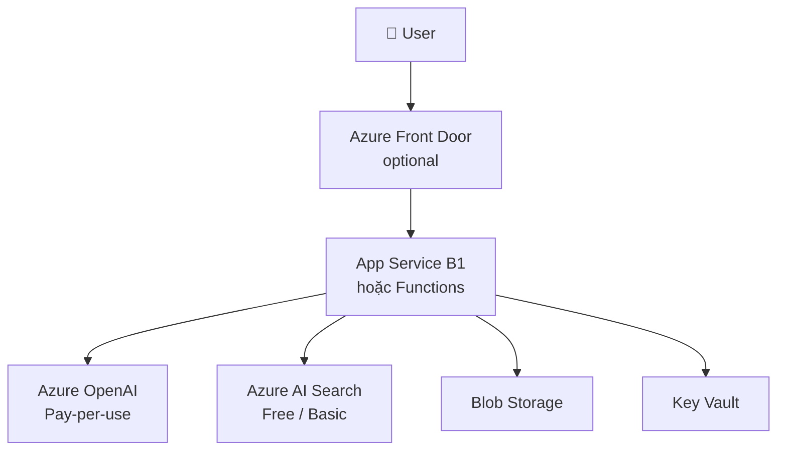
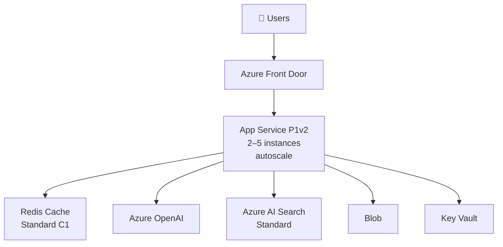
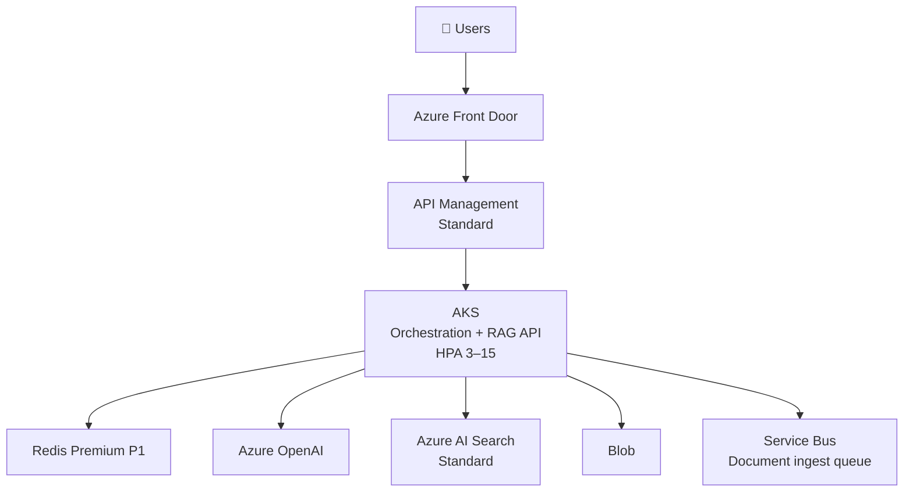
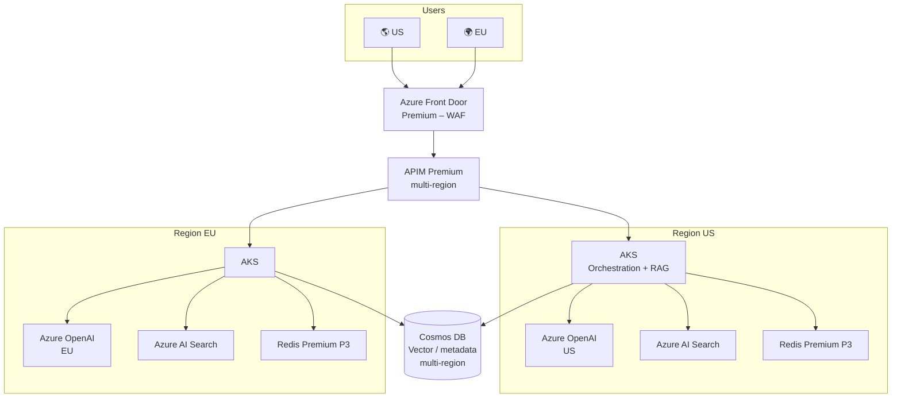

# Azure AI Application by Scale – LLM, RAG, Agent

Tài liệu thiết kế **hệ thống AI Application** (gọi LLM qua API: RAG, chatbot, agent) trên Azure theo **thang request** (1K → 2M+ request/ngày). Mỗi tier có **use case cụ thể** và **Azure services + setup** tương ứng.

---

## 1. Tổng quan

| Tier | Request/ngày | Use case điển hình | Azure services chính |
|------|----------------|---------------------|------------------------|
| **Tier 1** | ~1K – 10K | FAQ nội bộ, demo RAG, POC | Azure OpenAI, Azure AI Search (Free/Basic), App Service / Functions, Blob, Key Vault |
| **Tier 2** | ~10K – 100K | Chatbot support, RAG sản phẩm, copilot nội bộ | Azure OpenAI, Azure AI Search Standard, App Service (autoscale), Redis, Front Door |
| **Tier 3** | ~100K – 500K | RAG multi-tenant, agent ticket, enterprise copilot | AKS, APIM, Azure OpenAI, Azure AI Search, Redis Premium, Service Bus |
| **Tier 4** | ~500K – 2M+ | AI global, multi region, compliance (GDPR) | Multi-region AKS, Front Door Premium, APIM Premium, Cosmos DB, Azure OpenAI per region |

---

## 2. Tier 1: ~1K – 10K request/ngày

### Use case cụ thể

- **Chatbot FAQ nội bộ**: Nhân viên hỏi đáp chính sách công ty, quy trình; vài trăm user, vài nghìn câu/ngày.
- **Demo RAG cho sales**: Đối tác/sales tra cứu tài liệu sản phẩm, báo giá; dùng trong meeting, traffic thấp.
- **POC hỏi đáp tài liệu**: Proof of concept RAG trên bộ tài liệu (PDF, Word); 1 team dùng, đánh giá trước khi scale.

### Kiến trúc

### Azure services & setup

| Service | Setup |
|---------|--------|
| **Azure OpenAI** | 1 deployment (e.g. gpt-4o-mini); pay-per-token; không reserved capacity. |
| **Azure AI Search** | Free (3 index) hoặc Basic; 1 index cho RAG; vector search nếu cần. |
| **App Service** | B1, 1 instance; orchestration (LangChain/Semantic Kernel) + RAG. Hoặc **Functions** Consumption. |
| **Blob** | Document store; indexing vào Search. |
| **Key Vault** | API key OpenAI, connection string Search. |

**Tối ưu:** Prompt ngắn; cache response (Redis optional); giới hạn token/request.

---

## 3. Tier 2: ~10K – 100K request/ngày

### Use case cụ thể

- **Customer support chatbot**: Khách hỏi đáp sản phẩm, đổi trả, vận chuyển; 10K–100K câu/ngày; cần uptime, cache câu hỏi hay gặp.
- **RAG knowledge base sản phẩm**: Trang “Hỏi đáp” hoặc search thông minh trên tài liệu sản phẩm; traffic theo giờ cao điểm.
- **Internal copilot**: Nhân viên dùng chatbot tra cứu tài liệu nội bộ, tổng hợp; vài nghìn user, autoscale theo giờ làm việc.

### Kiến trúc

### Azure services & setup

| Service | Setup |
|---------|--------|
| **App Service** | P1v2; autoscale 2–5 instance (CPU hoặc HTTP queue). |
| **Azure OpenAI** | Thêm deployment (gpt-4o) cho route nặng; rate limit phía app. |
| **Azure AI Search** | Standard (S1); index RAG + vector. |
| **Redis** | Standard C1; cache embedding + response; TTL 5–60 phút. |
| **Front Door** | Standard; CDN; route /api tới App Service. |

**Tối ưu:** Semantic cache; streaming; giới hạn context length.

---

## 4. Tier 3: ~100K – 500K request/ngày

### Use case cụ thể

- **RAG multi-tenant SaaS**: Mỗi công ty 1 knowledge base; nhiều tenant, document ingest thường xuyên; API gateway rate limit theo tenant.
- **Agent xử lý ticket**: Bot nhận ticket, gọi tool (tra cứu CRM, tạo task, gửi email); nhiều bước, queue async khi cần.
- **Enterprise copilot**: Tích hợp SharePoint/Teams; RAG trên tài liệu công ty; nhiều use case (tổng hợp, soạn thảo); cần tách API sync vs worker ingest.

### Kiến trúc

### Azure services & setup

| Service | Setup |
|---------|--------|
| **AKS** | 3–10 nodes; HPA min 3, max 15 (CPU hoặc request/sec). |
| **API Management** | Standard; rate limit, versioning, cache; backend = AKS Ingress. |
| **Azure OpenAI** | Nhiều deployment; retry + circuit breaker. |
| **Azure AI Search** | S1/S2; nhiều index (tenant/use case); vector + hybrid. |
| **Redis Premium** | P1; cache embedding + response. |
| **Service Bus** | Queue document ingest → worker embed → update Search. |

**Tối ưu:** Tách API sync vs worker async; PDB; observability (trace RAG, token cost).

---

## 5. Tier 4: ~500K – 2M+ request/ngày

### Use case cụ thể

- **AI ứng dụng global**: Chatbot/RAG phục vụ user nhiều châu lục; latency thấp (route về region gần); 99.99% SLA.
- **Compliance (GDPR)**: Data EU lưu và xử lý tại EU; Azure OpenAI + AKS + Search tại EU; Front Door geo routing.
- **Chatbot triệu request**: Support 24/7, đa ngôn ngữ; WAF, bot protection; cost tối ưu theo region và cache.

### Kiến trúc

### Azure services & setup

| Service | Setup |
|---------|--------|
| **Front Door Premium** | WAF (OWASP); bot protection; geo routing. |
| **APIM Premium** | Multi-region (US + EU); rate limit, cache, auth. |
| **AKS** | 2+ region; 3–15 nodes/region; HPA; Availability Zones. |
| **Azure OpenAI** | Deployment per region; fallback khi lỗi. |
| **Azure AI Search** | Standard/Premium; replica multi-region nếu Premium. |
| **Cosmos DB** | Multi-region write; vector/metadata; partition key tenant/region. |
| **Redis** | Premium P3 mỗi region. |

**Tối ưu:** Health probe + failover; Content Safety per region; audit log; cost theo region.

---

## 6. Bảng chọn nhanh (AI Application)

| Use case | Tier |
|----------|------|
| FAQ nội bộ, demo RAG, POC | Tier 1 |
| Support chatbot, RAG sản phẩm, copilot nội bộ | Tier 2 |
| RAG multi-tenant, agent ticket, enterprise copilot | Tier 3 |
| AI global, GDPR, triệu request | Tier 4 |

---

## 7. Tài liệu tham khảo

- [Azure OpenAI](https://learn.microsoft.com/en-us/azure/ai-services/openai/)
- [Azure AI Search](https://learn.microsoft.com/en-us/azure/search/)
- [Azure Front Door](https://learn.microsoft.com/en-us/azure/frontdoor/)
- [AKS Best practices](https://learn.microsoft.com/en-us/azure/aks/best-practices)
