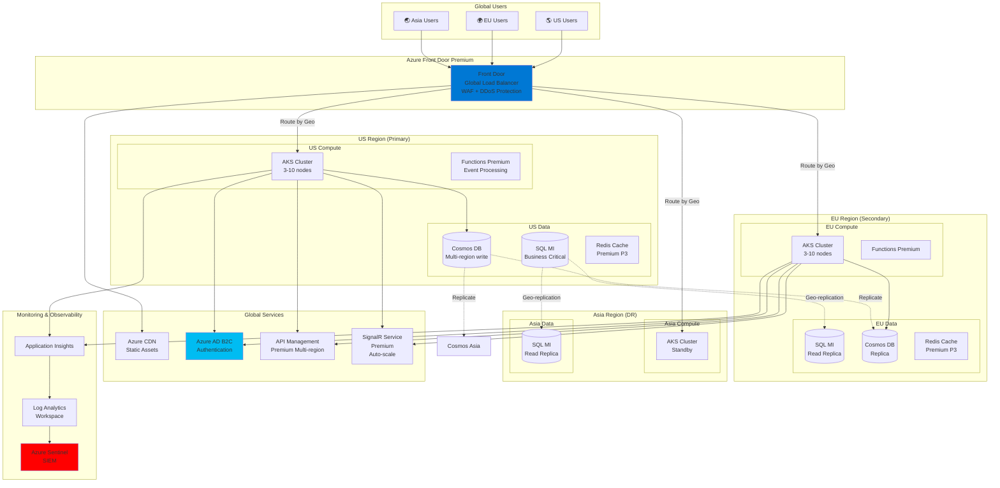

# Architecture: Global SaaS Platform (Production-Grade)

## Use Case
**Nền tảng SaaS quản lý dự án (như Jira, Asana)**
- Multi-tenant (nhiều công ty dùng chung hạ tầng)
- 500,000 - 2M users toàn cầu
- 99.99% uptime SLA
- Data residency compliance (GDPR, data ở EU phải lưu ở EU)
- Real-time collaboration

---

## Architecture Diagram



---

## Chi tiết Setup & Configuration

### 1. Azure Front Door Premium
**Tại sao Premium? ($330/tháng)**
- WAF với OWASP ruleset
- Bot protection (ML-based)
- Private Link support
- Managed SSL certificates

**Cấu hình:**
```bash
# Tạo Front Door Profile
az afd profile create \
  --profile-name fd-saas-global \
  --resource-group rg-saas-global \
  --sku Premium_AzureFrontDoor

# Endpoint
az afd endpoint create \
  --profile-name fd-saas-global \
  --endpoint-name saas-app \
  --resource-group rg-saas-global

# Origin Group (Multi-region)
az afd origin-group create \
  --profile-name fd-saas-global \
  --origin-group-name aks-origins \
  --probe-path /health \
  --probe-protocol Https \
  --probe-interval-in-seconds 30 \
  --sample-size 4 \
  --successful-samples-required 3 \
  --additional-latency-in-milliseconds 50
```

**WAF Policy:**
```bash
# Tạo WAF Policy
az network front-door waf-policy create \
  --name waf-saas-global \
  --resource-group rg-saas-global \
  --sku Premium_AzureFrontDoor \
  --mode Prevention

# Enable OWASP 3.2 ruleset
az network front-door waf-policy managed-rules add \
  --policy-name waf-saas-global \
  --resource-group rg-saas-global \
  --type Microsoft_DefaultRuleSet \
  --version 2.1 \
  --action Block

# Rate limiting (DDoS protection)
az network front-door waf-policy rule create \
  --policy-name waf-saas-global \
  --resource-group rg-saas-global \
  --name RateLimitRule \
  --rule-type RateLimitRule \
  --rate-limit-threshold 1000 \
  --rate-limit-duration-in-minutes 1 \
  --action Block
```

**Geo-routing (Data Residency):**
```json
{
  "routingRules": [
    {
      "name": "EU-users-to-EU-region",
      "conditions": {
        "geoFilter": {
          "countryCodes": ["DE", "FR", "IT", "ES", "NL"]
        }
      },
      "routeConfiguration": {
        "originGroupId": "/subscriptions/.../originGroups/eu-aks-origin"
      }
    },
    {
      "name": "US-users-to-US-region",
      "conditions": {
        "geoFilter": {
          "countryCodes": ["US", "CA", "MX"]
        }
      },
      "routeConfiguration": {
        "originGroupId": "/subscriptions/.../originGroups/us-aks-origin"
      }
    }
  ]
}
```

---

### 2. Multi-region AKS (Active-Active)

**US Region AKS:**
```bash
# Tạo AKS với Zone Redundancy
az aks create \
  --resource-group rg-saas-us \
  --name aks-saas-us-prod \
  --location eastus \
  --node-count 3 \
  --node-vm-size Standard_D4s_v3 \
  --zones 1 2 3 \
  --enable-cluster-autoscaler \
  --min-count 3 \
  --max-count 10 \
  --network-plugin azure \
  --network-policy azure \
  --enable-managed-identity \
  --enable-addons monitoring,azure-keyvault-secrets-provider \
  --uptime-sla
```

**EU Region AKS (same config):**
```bash
az aks create \
  --resource-group rg-saas-eu \
  --name aks-saas-eu-prod \
  --location westeurope \
  --node-count 3 \
  --node-vm-size Standard_D4s_v3 \
  --zones 1 2 3 \
  --enable-cluster-autoscaler \
  --min-count 3 \
  --max-count 10 \
  --uptime-sla
```

**Deployment Strategy - Blue/Green với Argo CD:**
```yaml
apiVersion: argoproj.io/v1alpha1
kind: Rollout
metadata:
  name: api-service
spec:
  replicas: 5
  strategy:
    blueGreen:
      activeService: api-service-active
      previewService: api-service-preview
      autoPromotionEnabled: false  # Manual approval
      scaleDownDelaySeconds: 300   # Giữ old version 5 phút
  template:
    spec:
      containers:
      - name: api
        image: acrsaas.azurecr.io/api-service:v2.3.1
        resources:
          requests:
            cpu: 500m
            memory: 1Gi
          limits:
            cpu: 1
            memory: 2Gi
        livenessProbe:
          httpGet:
            path: /health/live
            port: 8080
          initialDelaySeconds: 30
          timeoutSeconds: 5
        readinessProbe:
          httpGet:
            path: /health/ready
            port: 8080
          initialDelaySeconds: 10
          periodSeconds: 5
```

---

### 3. Azure SQL Managed Instance (Business Critical)
**Tại sao MI thay vì Azure SQL Database?**
- 99.99% SLA (vs 99.95%)
- Gần như 100% compatible với SQL Server on-premise
- Support cross-database queries
- Managed backup với retention 35 ngày

**SKU**: Business Critical, Gen5, 8 vCores (~$3,600/tháng mỗi region)

**Cấu hình:**
```bash
# US Primary
az sql mi create \
  --name sqlmi-saas-us-prod \
  --resource-group rg-saas-us \
  --location eastus \
  --admin-user sqladmin \
  --admin-password <STRONG_PASSWORD> \
  --subnet /subscriptions/.../subnets/sqlmi-subnet \
  --capacity 8 \
  --family Gen5 \
  --edition BusinessCritical \
  --storage 1024GB \
  --tier BusinessCritical \
  --zone-redundant
```

**Geo-replication (Auto-failover Group):**
```bash
# Tạo Failover Group (US ↔ EU)
az sql instance-failover-group create \
  --name fog-saas-us-eu \
  --mi sqlmi-saas-us-prod \
  --resource-group rg-saas-us \
  --partner-mi sqlmi-saas-eu-prod \
  --partner-resource-group rg-saas-eu \
  --failover-policy Automatic \
  --grace-period 1  # Auto-failover sau 1 giờ
```

**Connection String (Multi-region aware):**
```csharp
// Primary connection string
Server=tcp:fog-saas-us-eu.database.windows.net,1433;
Database=tenant_db;
User ID=sqladmin;
Password=<PASSWORD>;
ApplicationIntent=ReadWrite;  // Write to primary

// Read-only connection string (for analytics)
Server=tcp:fog-saas-us-eu.secondary.database.windows.net,1433;
Database=tenant_db;
User ID=sqladmin;
Password=<PASSWORD>;
ApplicationIntent=ReadOnly;  // Read from replica
```

---

### 4. Cosmos DB (Multi-region Write)
**Tại sao Cosmos DB?**
- Low latency (< 10ms P99)
- Multi-region write (active-active)
- Perfect cho real-time collaboration data

**SKU**: Autoscale 4,000 - 40,000 RU/s per region

**Cấu hình Multi-region:**
```bash
az cosmosdb create \
  --name cosmos-saas-global \
  --resource-group rg-saas-global \
  --kind GlobalDocumentDB \
  --default-consistency-level Session \
  --locations regionName=eastus failoverPriority=0 isZoneRedundant=true \
  --locations regionName=westeurope failoverPriority=1 isZoneRedundant=true \
  --locations regionName=southeastasia failoverPriority=2 isZoneRedundant=true \
  --enable-multiple-write-locations true \
  --enable-automatic-failover true
```

**Multi-tenant Data Model:**
```json
{
  "id": "task_12345",
  "tenantId": "company_abc",  // Partition key
  "projectId": "proj_001",
  "title": "Implement feature X",
  "assignee": "user_789",
  "status": "in_progress",
  "createdAt": "2024-01-30T10:00:00Z",
  "updatedAt": "2024-01-30T14:30:00Z",
  "_ts": 1706623800  // Built-in timestamp for conflict resolution
}
```

**Conflict Resolution Policy:**
```json
{
  "conflictResolutionPolicy": {
    "mode": "LastWriterWins",
    "conflictResolutionPath": "/_ts"
  }
}
```

---

### 5. Azure AD B2C (Authentication)
**Tại sao B2C thay vì AD B2B?**
- Customize UI hoàn toàn (white-label)
- Social login (Google, Facebook, GitHub)
- MFA built-in
- 50,000 MAU (Monthly Active Users) miễn phí

**User Flow - Sign Up/In:**
```xml
<TrustFrameworkPolicy xmlns="http://schemas.microsoft.com/online/cpim/schemas/2013/06/2.0">
  <BuildingBlocks>
    <ClaimsSchema>
      <ClaimType Id="tenantId">
        <DisplayName>Tenant ID</DisplayName>
        <DataType>string</DataType>
      </ClaimType>
      <ClaimType Id="role">
        <DisplayName>User Role</DisplayName>
        <DataType>string</DataType>
      </ClaimType>
    </ClaimsSchema>
  </BuildingBlocks>
  
  <UserJourneys>
    <UserJourney Id="SignUpOrSignIn">
      <OrchestrationSteps>
        <OrchestrationStep Order="1" Type="CombinedSignInAndSignUp">
          <ClaimsProviderSelections>
            <ClaimsProviderSelection TargetClaimsExchangeId="GoogleExchange" />
            <ClaimsProviderSelection TargetClaimsExchangeId="MicrosoftExchange" />
          </ClaimsProviderSelections>
        </OrchestrationStep>
        <!-- Lookup tenant by email domain -->
        <OrchestrationStep Order="2" Type="ClaimsExchange">
          <ClaimsExchanges>
            <ClaimsExchange Id="LookupTenant" TechnicalProfileReferenceId="REST-LookupTenant" />
          </ClaimsExchanges>
        </OrchestrationStep>
      </OrchestrationSteps>
    </UserJourney>
  </UserJourneys>
</TrustFrameworkPolicy>
```

**JWT Token (Custom Claims):**
```json
{
  "iss": "https://saasapp.b2clogin.com",
  "sub": "user_789",
  "email": "john@company.com",
  "tenantId": "company_abc",  // Custom claim
  "role": "admin",            // Custom claim
  "exp": 1706627400
}
```

---

### 6. Azure SignalR Service (Real-time Collaboration)
**SKU**: Premium P1 (1000 units, 100K concurrent) - ~$500/tháng

**Auto-scaling:**
```bash
az signalr create \
  --name signalr-saas-global \
  --resource-group rg-saas-global \
  --sku Premium_P1 \
  --unit-count 1 \
  --service-mode Default

# Enable auto-scale
az monitor autoscale create \
  --resource-group rg-saas-global \
  --resource signalr-saas-global \
  --resource-type Microsoft.SignalRService/SignalR \
  --name signalr-autoscale \
  --min-count 1 \
  --max-count 10 \
  --count 1

az monitor autoscale rule create \
  --resource-group rg-saas-global \
  --autoscale-name signalr-autoscale \
  --condition "ConnectionCount > 80000 avg 5m" \
  --scale out 2
```

**Hub Configuration - Task Updates:**
```csharp
// Server-side (.NET)
public class TaskHub : Hub
{
    public async Task JoinProject(string projectId)
    {
        // Add user to project group
        await Groups.AddToGroupAsync(Context.ConnectionId, $"project:{projectId}");
    }
    
    public async Task BroadcastTaskUpdate(string projectId, TaskUpdateDto update)
    {
        // Broadcast to all users in project
        await Clients.Group($"project:{projectId}")
            .SendAsync("TaskUpdated", update);
    }
}
```

---

### 7. Monitoring & Alerting (SRE Platform)

**Application Insights - Distributed Tracing:**
```yaml
# OpenTelemetry configuration
apiVersion: v1
kind: ConfigMap
metadata:
  name: otel-collector-config
data:
  config.yaml: |
    receivers:
      otlp:
        protocols:
          grpc:
          http:
    processors:
      batch:
      memory_limiter:
        limit_mib: 512
    exporters:
      azuremonitor:
        instrumentation_key: "<APP_INSIGHTS_KEY>"
        endpoint: "https://eastus-5.in.applicationinsights.azure.com/"
    service:
      pipelines:
        traces:
          receivers: [otlp]
          processors: [batch, memory_limiter]
          exporters: [azuremonitor]
```

**SLO Monitoring (Prometheus + Grafana on AKS):**
```yaml
apiVersion: v1
kind: ConfigMap
metadata:
  name: slo-rules
data:
  slo.rules: |
    groups:
      - name: slo
        interval: 30s
        rules:
          # Availability SLO: 99.99% uptime
          - record: slo:availability:ratio
            expr: |
              sum(rate(http_requests_total{status!~"5.."}[5m])) /
              sum(rate(http_requests_total[5m]))
          
          # Latency SLO: 95% requests < 200ms
          - record: slo:latency:ratio
            expr: |
              histogram_quantile(0.95, 
                sum(rate(http_request_duration_seconds_bucket[5m])) by (le)
              ) < 0.2
          
          # Error Budget Alert
          - alert: ErrorBudgetExhausted
            expr: slo:availability:ratio < 0.9999
            for: 5m
            labels:
              severity: critical
            annotations:
              summary: "SLO violation: Availability below 99.99%"
```

---

## Disaster Recovery Strategy

### RTO (Recovery Time Objective): 5 phút
### RPO (Recovery Point Objective): 0 (zero data loss)

**Automated Failover:**
1. Azure Front Door phát hiện US region down
2. Tự động route traffic sang EU region
3. SQL MI Auto-failover group tự động promote EU làm primary
4. Cosmos DB tự động reroute write sang EU
5. Monitoring alert team via PagerDuty

**Chaos Engineering (Test DR):**
```bash
# Dùng Azure Chaos Studio
az chaos experiment create \
  --name "simulate-region-failure" \
  --resource-group rg-saas-global \
  --steps '[
    {
      "name": "Shutdown AKS US",
      "selector": "aks-saas-us-prod",
      "action": "shutdown",
      "duration": "PT30M"
    }
  ]'
```

---

## Chi phí ước tính (Monthly)

| Service | SKU | Số lượng | Giá |
|---------|-----|----------|-----|
| AKS (US + EU) | D4s_v3 x 6 nodes avg | 2 regions | $1,368 |
| SQL MI (US + EU) | BC 8vCore | 2 instances | $7,200 |
| Cosmos DB | 10K RU/s x 3 regions | Global | $1,752 |
| Redis Cache (US + EU) | Premium P3 | 2 instances | $1,040 |
| Front Door | Premium | 1 | $330 |
| SignalR | Premium P1 | Auto-scale avg | $500 |
| Azure AD B2C | 100K MAU | 1 | $145 |
| Application Insights | 100GB/day | 1 | $230 |
| CDN | 10TB egress | 1 | $800 |
| **TỔNG** | | | **~$13,365/tháng** |

**Revenue/Cost Ratio:** Nếu mỗi user trả $10/tháng → Cần 1,337 paying users để break-even.

---

## Security & Compliance

✅ **Zero Trust Architecture:**
- Private Endpoint cho tất cả PaaS services
- NSG rules chặn traffic không cần thiết
- Just-In-Time VM access

✅ **GDPR Compliance:**
- Data residency: EU data lưu ở EU region
- Right to be forgotten: Delete API
- Data export API

✅ **SOC 2 Compliance:**
- Azure Policy enforcement
- Immutable audit logs (Log Analytics Workspace)
- Quarterly penetration testing

✅ **Encryption:**
- TLS 1.3 in-transit
- AES-256 at-rest (Cosmos DB, SQL MI, Blob)
- Customer-managed keys (CMK) trong Key Vault
