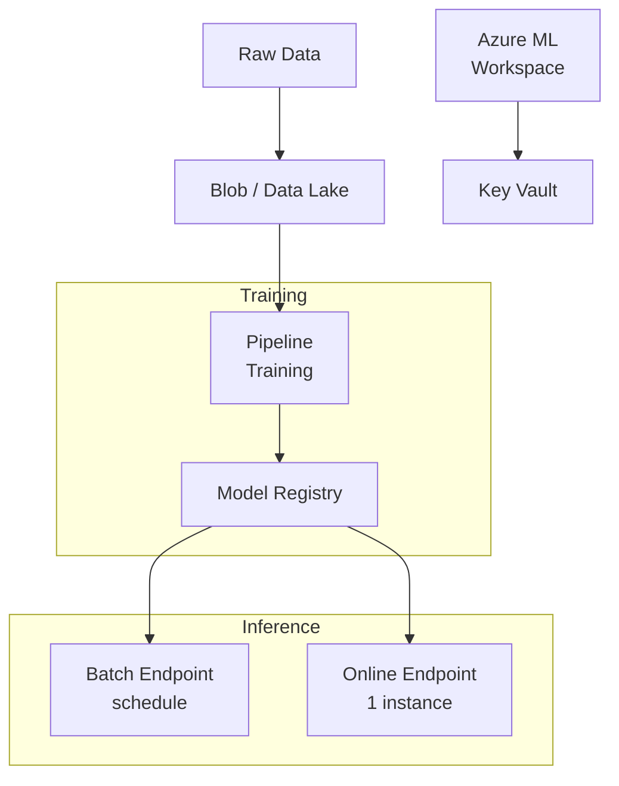
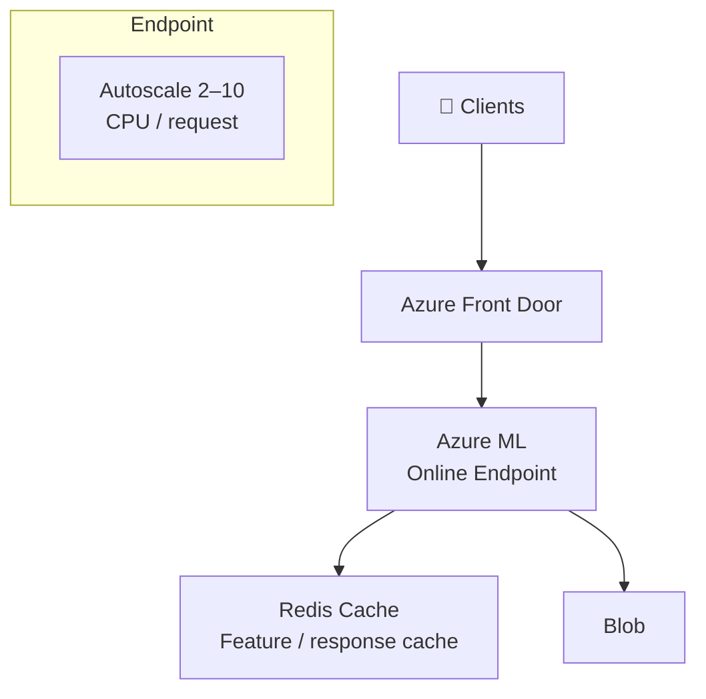
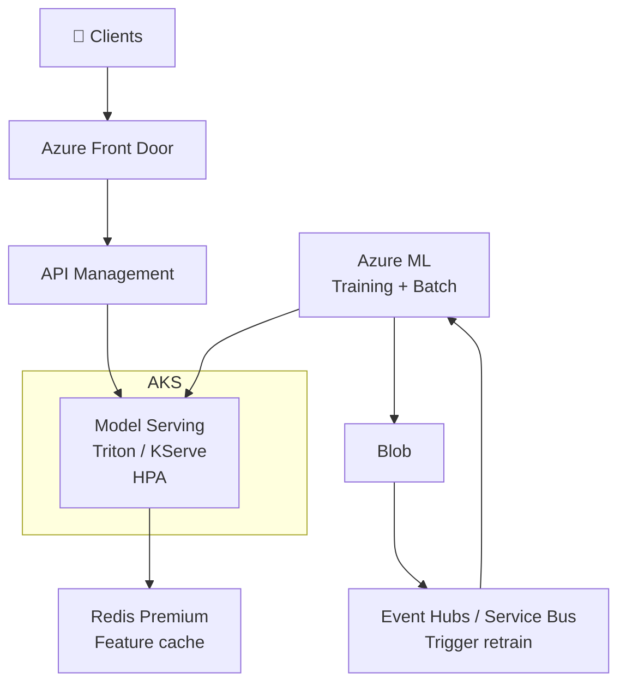
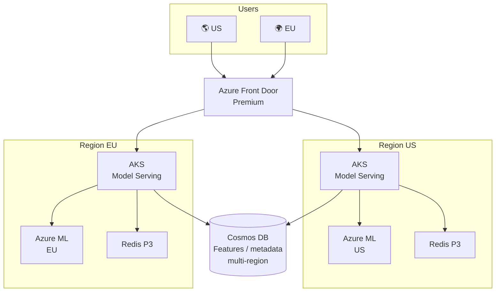

# Azure AI Machine Learning / Deep Learning by Scale

Tài liệu thiết kế **hệ thống Machine Learning / Deep Learning** (train model, batch inference, online inference) trên Azure theo **thang request** (1K → 2M+ request/ngày). Mỗi tier có **use case cụ thể** và **Azure services + setup** tương ứng.

---

## 1. Tổng quan

| Tier | Request/ngày | Use case điển hình | Azure services chính |
|------|----------------|---------------------|------------------------|
| **Tier 1** | ~1K – 10K | Batch lead scoring, báo cáo dự đoán, tool classification nội bộ | Azure ML (batch + online 1 instance), Blob/Data Lake, Key Vault |
| **Tier 2** | ~10K – 100K | Fraud detection real-time, recommendation API, personalization | Azure ML Online Endpoint (autoscale), Redis, Front Door |
| **Tier 3** | ~100K – 500K | Nhiều model (fraud, CV, NLP), AKS Triton/KServe, retrain theo sự kiện | AKS, Azure ML (training + batch), Redis Premium, Event Hubs/Service Bus, APIM |
| **Tier 4** | ~500K – 2M+ | ML global, CV multi region, data residency (EU) | Multi-region AKS/Azure ML, Front Door Premium, Cosmos DB, Redis P3 |

---

## 2. Tier 1: ~1K – 10K request/ngày

### Use case cụ thể

- **Batch lead scoring (B2B)**: Hàng ngày/tuần chạy điểm cho lead từ CRM; ghi kết quả vào DB; sales ưu tiên lead điểm cao.
- **Báo cáo dự đoán doanh thu**: Pipeline chạy theo lịch (tuần/tháng); model forecast; output là báo cáo hoặc dashboard.
- **Internal tool classification**: Nhân viên upload ảnh/văn bản, model phân loại (quality check, gắn nhãn); vài trăm request/ngày; online 1 instance đủ.

### Kiến trúc

### Azure services & setup

| Service | Setup |
|---------|--------|
| **Azure ML** | Workspace; **Batch Endpoint** (schedule hourly/daily); **Online Endpoint** 1 instance (e.g. Standard_DS2_v2). |
| **Blob / Data Lake** | Raw data, training output; input/output batch. |
| **Model Registry** | Version model; promote staging → prod. |

**Tối ưu:** Ưu tiên batch; online chỉ khi cần real-time; instance nhỏ; scale-to-zero nếu dùng serverless.

---

## 3. Tier 2: ~10K – 100K request/ngày

### Use case cụ thể

- **Fraud detection real-time**: Mỗi giao dịch gọi API inference; latency <200ms; autoscale theo giờ cao điểm; cache cho same input (optional).
- **Recommendation API**: App/web gọi API lấy gợi ý sản phẩm/nội dung; 10K–100K request/ngày; cache theo user/session để giảm load.
- **Personalization trên web**: Model chọn banner/CTA theo user; inference real-time; Redis cache feature hoặc response.

### Kiến trúc

### Azure services & setup

| Service | Setup |
|---------|--------|
| **Azure ML Online Endpoint** | Autoscale 2–10 instance (CPU 70% hoặc request count); deployment + scoring script. |
| **Redis** | Cache feature (Feature Store offline) hoặc cache response (hash input). |
| **Front Door** | Single entry; health probe; optional CDN. |

**Tối ưu:** Resource request/limit đúng; readiness probe; cache key = hash(features).

---

## 4. Tier 3: ~100K – 500K request/ngày

### Use case cụ thể

- **Nhiều model trong 1 nền tảng**: Fraud + recommendation + NLP (sentiment, classification); mỗi model scale độc lập; AKS với Triton/KServe hoặc Azure ML Managed.
- **Computer vision quality check**: Ảnh sản phẩm đưa vào model phát hiện lỗi; throughput cao; có thể cần GPU node pool; retrain khi có data mới (Event Hubs trigger).
- **Retrain theo sự kiện**: Data mới lên Blob/Data Lake → event trigger pipeline training → model mới promote lên staging → A/B rồi prod.

### Kiến trúc

### Azure services & setup

| Service | Setup |
|---------|--------|
| **AKS** | Node pool inference (GPU nếu cần); Triton hoặc KServe; HPA theo request. |
| **Azure ML** | Training pipeline (schedule/data trigger); Batch Endpoint; model deploy AKS hoặc Azure ML Managed. |
| **Redis Premium** | Feature cache (online store) nếu dùng Feature Store. |
| **Event Hubs / Service Bus** | Event trigger retraining khi data mới. |
| **APIM** | Rate limit; versioning (model v1/v2). |

**Tối ưu:** Tách node pool GPU vs CPU; PDB; monitoring drift + latency.

---

## 5. Tier 4: ~500K – 2M+ request/ngày

### Use case cụ thể

- **Recommendation global**: User US và EU; inference tại region gần user; data residency (EU data ở EU); Cosmos DB hoặc SQL cho feature/metadata multi-region.
- **Computer vision multi region**: Giám sát an ninh, quality check nhà máy; camera nhiều quốc gia; model serve tại region; HA, rollback version.
- **ML compliance (GDPR, ngành dọc)**: Training và inference tại EU; audit log; model versioning; Front Door geo routing đảm bảo EU traffic vào EU.

### Kiến trúc

### Azure services & setup

| Service | Setup |
|---------|--------|
| **Front Door Premium** | Geo routing; WAF; health probe; failover. |
| **AKS** | 2+ region; Triton/KServe hoặc Azure ML Managed; Availability Zones. |
| **Azure ML** | Workspace per region (hoặc 1 global + endpoint multi-region); training gần data nếu compliance. |
| **Cosmos DB** | Feature metadata hoặc feature cache multi-region. |
| **Redis** | Premium P3 mỗi region; feature/response cache. |

**Tối ưu:** Data residency; model versioning + rollback; SLA monitoring.

---

## 6. Bảng chọn nhanh (AI ML/DL)

| Use case | Tier |
|----------|------|
| Batch lead scoring, báo cáo dự đoán, tool classification nội bộ | Tier 1 |
| Fraud real-time, recommendation API, personalization | Tier 2 |
| Nhiều model, CV quality check, retrain theo sự kiện | Tier 3 |
| ML global, CV multi region, compliance (GDPR) | Tier 4 |

---

## 7. Tài liệu tham khảo

- [Azure ML – Endpoints](https://learn.microsoft.com/en-us/azure/machine-learning/concept-endpoints)
- [Azure ML – Batch inference](https://learn.microsoft.com/en-us/azure/machine-learning/concept-batch-inference)
- [Azure Front Door](https://learn.microsoft.com/en-us/azure/frontdoor/)
- [AKS Best practices](https://learn.microsoft.com/en-us/azure/aks/best-practices)
