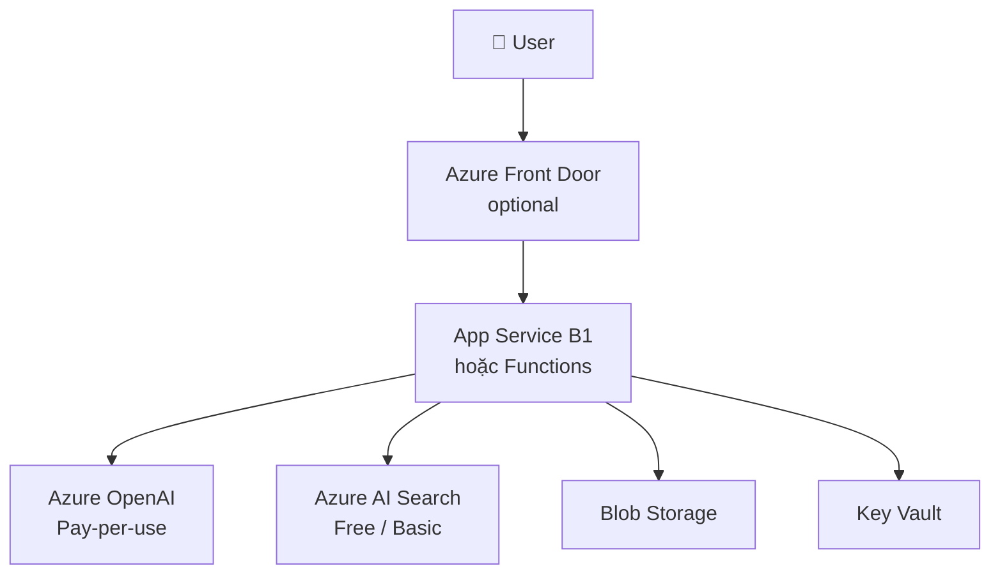
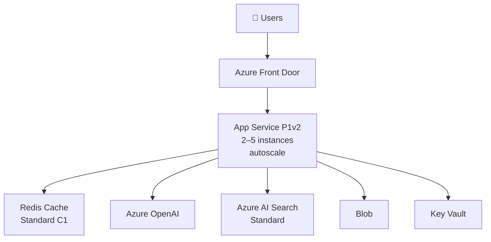
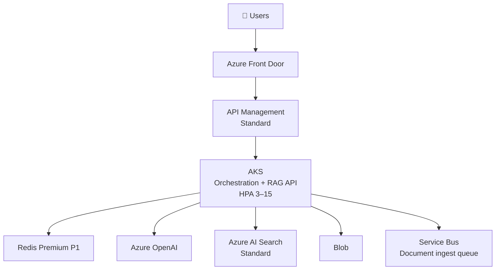
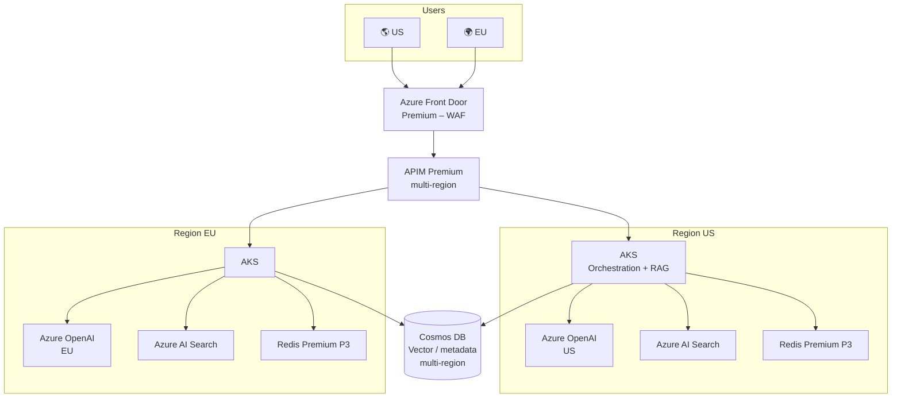
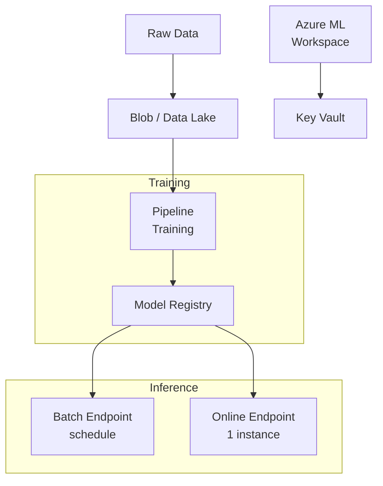
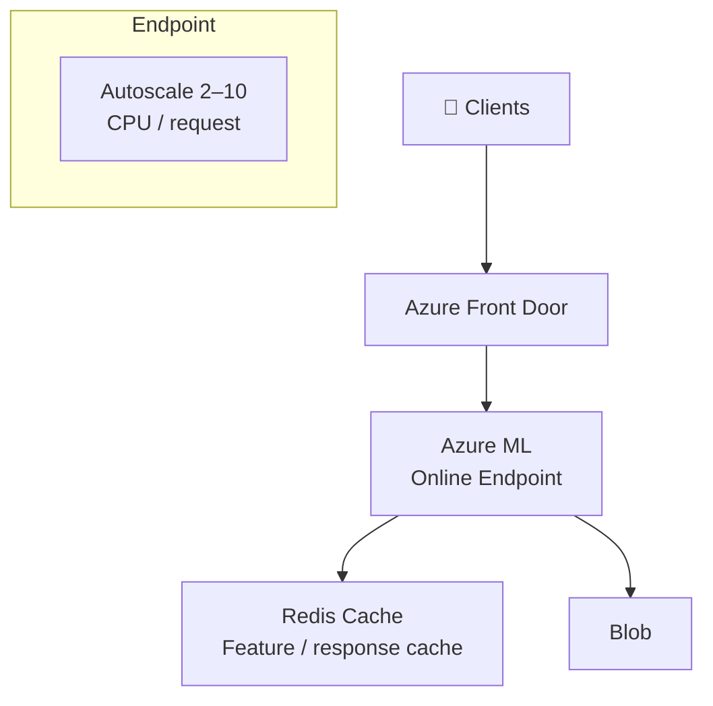
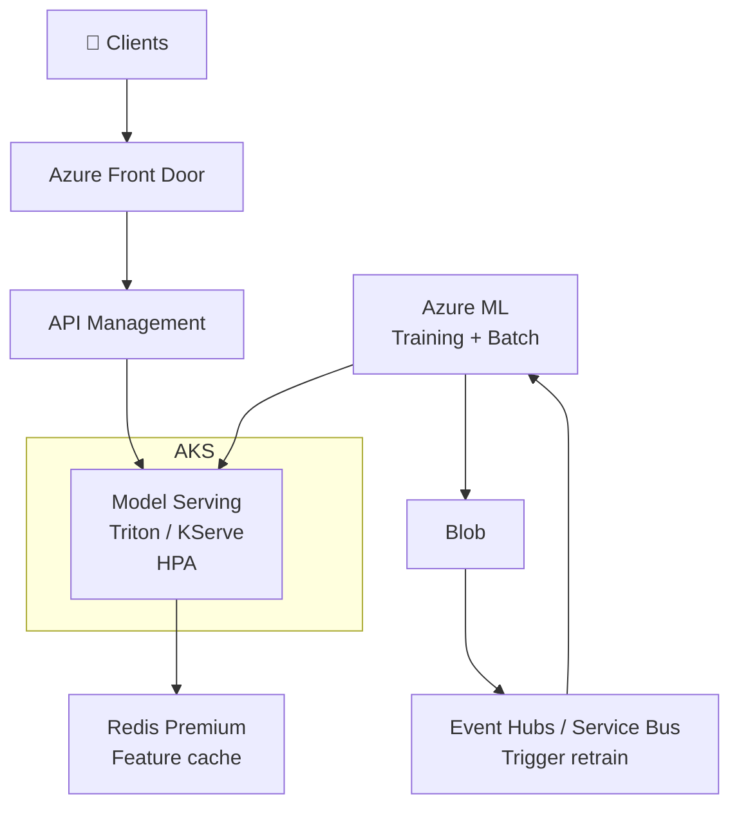
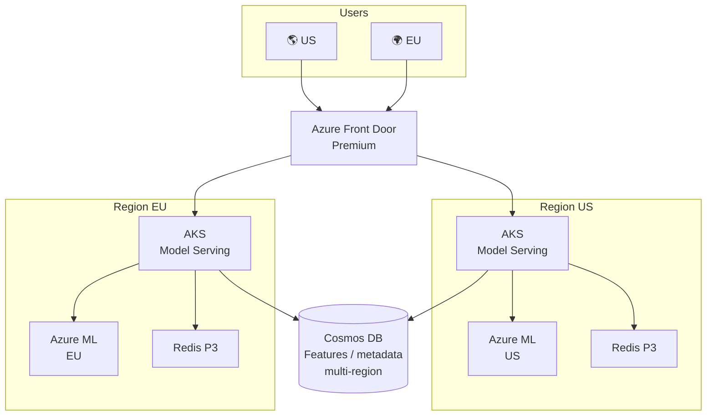

# Azure AI Architectures by Scale – AI Application & AI ML/DL

Tài liệu thiết kế **hệ thống backend AI** trên Azure theo **thang request** (nghìn → triệu), chia thành **hai nhánh**:

1. **AI Application** – Ứng dụng gọi LLM qua API (RAG, chatbot, agent); dùng Azure OpenAI, Azure AI Search, Azure AI Foundry…
2. **AI Machine Learning / Deep Learning** – Hệ thống train & serve model (classification, CV, NLP custom); dùng Azure ML, batch/online inference, Feature Store…

Mỗi nhánh có **nhiều kiến trúc** tương ứng **Tier 1 → Tier 4** (1K – 10K → 500K – 2M+ request/ngày), với **Azure services và setup** khác nhau để phù hợp lượng người dùng và tối ưu cost/latency.

---

## 1. Tổng quan theo scale

### AI Application (LLM via API)

| Tier | Request/ngày (ước lượng) | Kiến trúc | Azure services chính |
|------|---------------------------|-----------|------------------------|
| **Tier 1** | ~1K – 10K | Single region, serverless | Azure OpenAI, Azure AI Search (free/basic), App Service / Functions, Blob, Key Vault |
| **Tier 2** | ~10K – 100K | Scale-out + cache | Azure OpenAI, Azure AI Search Standard, App Service / AKS (HPA), Redis Cache, Front Door |
| **Tier 3** | ~100K – 500K | AKS + APIM + RAG | Azure OpenAI, Azure AI Search, AKS (orchestration + RAG), Redis Premium, APIM, Service Bus (async) |
| **Tier 4** | ~500K – 2M+ | Multi-region, global | Azure OpenAI multi-region, Azure AI Search, AKS multi-region, Front Door Premium (WAF), Cosmos DB (vector/cache), APIM Premium |

### AI Machine Learning / Deep Learning

| Tier | Request/ngày (ước lượng) | Kiến trúc | Azure services chính |
|------|---------------------------|-----------|------------------------|
| **Tier 1** | ~1K – 10K | Single endpoint, batch ưu tiên | Azure ML (batch inference + online 1 instance), Blob / Data Lake, Key Vault |
| **Tier 2** | ~10K – 100K | Online inference scale-out | Azure ML Online Endpoint (autoscale), Redis (feature cache nếu cần), Front Door |
| **Tier 3** | ~100K – 500K | AKS + Azure ML + Feature Store | Azure ML (training + batch), AKS (custom serving hoặc Azure ML), Redis Premium, Event Hubs / Service Bus |
| **Tier 4** | ~500K – 2M+ | Multi-region ML, HA | Azure ML multi-region endpoint, AKS multi-region (Triton/KServe), Cosmos DB / SQL (features), Front Door Premium |

---

## 2. AI Application (LLM) – Chi tiết từng tier

### Tier 1: ~1K – 10K request/ngày (AI Application)

**Use case:** Chatbot nội bộ, demo RAG, POC; vài nghìn request/ngày.

| Service | Setup |
|---------|--------|
| **Azure OpenAI** | 1 deployment (e.g. gpt-4o-mini); pay-per-token; không cần reserved capacity. |
| **Azure AI Search** | Free (3 index) hoặc Basic; 1 index cho RAG; vector search nếu cần. |
| **App Service** | B1, 1 instance; chạy orchestration (LangChain/Semantic Kernel) + RAG. Hoặc **Functions** Consumption cho API. |
| **Blob** | Document store cho RAG; indexing vào Search. |
| **Key Vault** | API key OpenAI, connection string Search. |

**Tối ưu:** Prompt ngắn; cache response theo semantic key (Redis optional); giới hạn token/request.

---

### Tier 2: ~10K – 100K request/ngày (AI Application)

**Use case:** Chatbot/RAG production nhỏ; cần autoscale, cache, CDN.

| Service | Setup |
|---------|--------|
| **App Service** | P1v2; **autoscale** 2–5 instance (CPU hoặc HTTP queue); orchestration + RAG. |
| **Azure OpenAI** | Có thể thêm deployment (gpt-4o) cho route nặng; rate limit phía app. |
| **Azure AI Search** | **Standard** (S1); index RAG + vector; shared private link nếu cần. |
| **Redis** | Standard C1; cache embedding, cache response (semantic/key); TTL 5–60 phút. |
| **Front Door** | Standard; CDN cho static; route /api tới App Service. |

**Tối ưu:** Semantic cache (tương tự query → cache); streaming response; giới hạn context length để giảm cost.

---

### Tier 3: ~100K – 500K request/ngày (AI Application)

**Use case:** RAG/agent production; nhiều tenant hoặc nhiều use case; async job (ingest document, batch embed).

| Service | Setup |
|---------|--------|
| **AKS** | 3–10 nodes; deployment orchestration + RAG; **HPA** theo CPU hoặc request/sec (min 3, max 15). |
| **API Management** | Standard; rate limit, versioning, cache; backend = AKS Ingress. |
| **Azure OpenAI** | Nhiều deployment (model, region) nếu cần; retry + circuit breaker trong app. |
| **Azure AI Search** | Standard (S1/S2); nhiều index (tenant hoặc use case); vector + hybrid. |
| **Redis Premium** | P1; cache embedding + response; persistence nếu cần. |
| **Service Bus** | Standard; queue document ingest → Function/worker embed → update Search. |

**Tối ưu:** Tách service: API sync (RAG/chat) vs worker async (ingest); PDB cho API; observability (trace RAG step, token cost).

---

### Tier 4: ~500K – 2M+ request/ngày (AI Application)

**Use case:** Global AI app; multi-region; WAF; 99.99%; compliance.

| Service | Setup |
|---------|--------|
| **Front Door Premium** | WAF (OWASP); bot protection; geo routing → APIM gần user. |
| **APIM Premium** | Multi-region (US + EU); rate limit, cache, auth. |
| **AKS** | 2+ region; mỗi region 3–15 nodes; HPA; Availability Zones. |
| **Azure OpenAI** | Deployment per region (latency); fallback region khi lỗi. |
| **Azure AI Search** | Standard/Premium; có thể multi-region (replica) nếu dùng Premium. |
| **Cosmos DB** | Multi-region write; container vector (embedding) hoặc metadata; partition key theo tenant/region. |
| **Redis** | Premium P3 mỗi region; cache không replicate (local). |

**Tối ưu:** Health probe + failover; Content Safety / filter per region; audit log; cost (token + embedding) theo region.

---

## 3. AI Machine Learning / Deep Learning – Chi tiết từng tier

### Tier 1: ~1K – 10K request/ngày (ML/DL)

**Use case:** Internal tool, batch scoring là chính; online inference ít.

| Service | Setup |
|---------|--------|
| **Azure ML** | Workspace; **Batch Endpoint** (schedule hourly/daily); **Online Endpoint** 1 instance (e.g. Standard_DS2_v2). |
| **Blob / Data Lake** | Raw data, training output; input/output cho batch. |
| **Model Registry** | Version model; promote staging → prod. |

**Tối ưu:** Ưu tiên batch; online chỉ khi cần real-time; instance nhỏ, scale-to-zero nếu dùng serverless option.

---

### Tier 2: ~10K – 100K request/ngày (ML/DL)

**Use case:** Online inference tăng; cần autoscale, latency ổn định.

| Service | Setup |
|---------|--------|
| **Azure ML Online Endpoint** | **Autoscale** 2–10 instance (CPU 70% hoặc request count); deployment với model + scoring script. |
| **Redis** | Cache feature (nếu dùng Feature Store offline) hoặc cache response cho same input. |
| **Front Door** | Single entry; health probe; optional CDN. |

**Tối ưu:** Resource request/limit đúng; probe readiness; cache key = hash(features) để giảm latency và cost.

---

### Tier 3: ~100K – 500K request/ngày (ML/DL)

**Use case:** Nhiều model, batch + online; có thể custom serving (Triton, KServe) trên AKS.

| Service | Setup |
|---------|--------|
| **AKS** | Node pool cho inference (GPU nếu cần); **Triton** hoặc **KServe**; HPA theo request. |
| **Azure ML** | Training pipeline (schedule/data trigger); Batch Endpoint; model deploy lên AKS hoặc Azure ML Managed Online. |
| **Redis Premium** | Feature cache (online store) nếu dùng Feature Store pattern. |
| **Event Hubs / Service Bus** | Event trigger retraining khi data mới. |
| **APIM** | Rate limit, versioning (model v1/v2). |

**Tối ưu:** Tách node pool (GPU vs CPU); PDB cho serving; monitoring drift + latency.

---

### Tier 4: ~500K – 2M+ request/ngày (ML/DL)

**Use case:** Global ML; multi-region inference; HA; compliance.

| Service | Setup |
|---------|--------|
| **Front Door Premium** | Geo routing; WAF; health probe; failover. |
| **AKS** | 2+ region; model serving (Triton/KServe hoặc Azure ML Managed); Availability Zones. |
| **Azure ML** | Workspace per region (hoặc 1 global + endpoint multi-region); training tại region gần data nếu compliance. |
| **Cosmos DB** | Feature store metadata hoặc feature cache multi-region (nếu cần). |
| **Redis** | Premium P3 mỗi region; feature/response cache. |

**Tối ưu:** Data residency (training + inference tại region đúng); model versioning + rollback; SLA monitoring.

---

## 4. Bảng chọn nhanh

| Nhu cầu | Nhánh | Tier gợi ý |
|---------|--------|------------|
| Chatbot/RAG demo, POC | AI Application | Tier 1 |
| RAG/agent production, 10K–100K req/ngày | AI Application | Tier 2 |
| RAG global, multi-tenant, 500K+ | AI Application | Tier 4 |
| Batch scoring là chính, ít online | AI ML/DL | Tier 1 |
| Online inference 10K–100K, autoscale | AI ML/DL | Tier 2 |
| Nhiều model, AKS custom serving | AI ML/DL | Tier 3 |
| ML global, HA, compliance | AI ML/DL | Tier 4 |

---

## 5. Tài liệu tham khảo

- [Azure OpenAI](https://learn.microsoft.com/en-us/azure/ai-services/openai/)
- [Azure AI Search](https://learn.microsoft.com/en-us/azure/search/)
- [Azure ML – Endpoints](https://learn.microsoft.com/en-us/azure/machine-learning/concept-endpoints)
- [Azure ML – Batch inference](https://learn.microsoft.com/en-us/azure/machine-learning/concept-batch-inference)
- [Azure Front Door](https://learn.microsoft.com/en-us/azure/frontdoor/)
- [AKS Best practices](https://learn.microsoft.com/en-us/azure/aks/best-practices)
