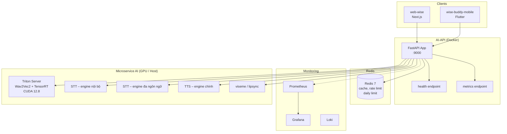
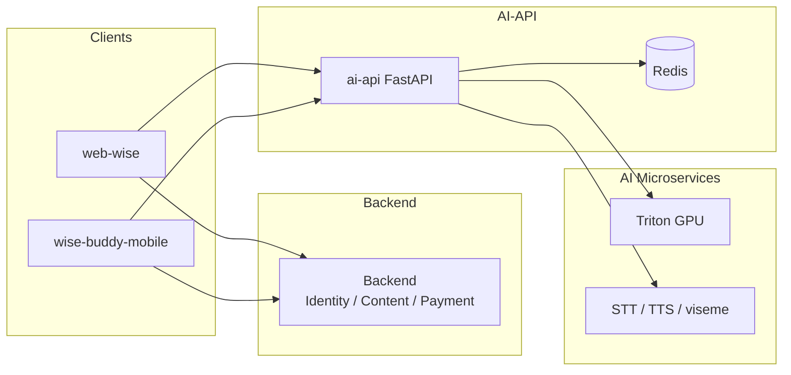
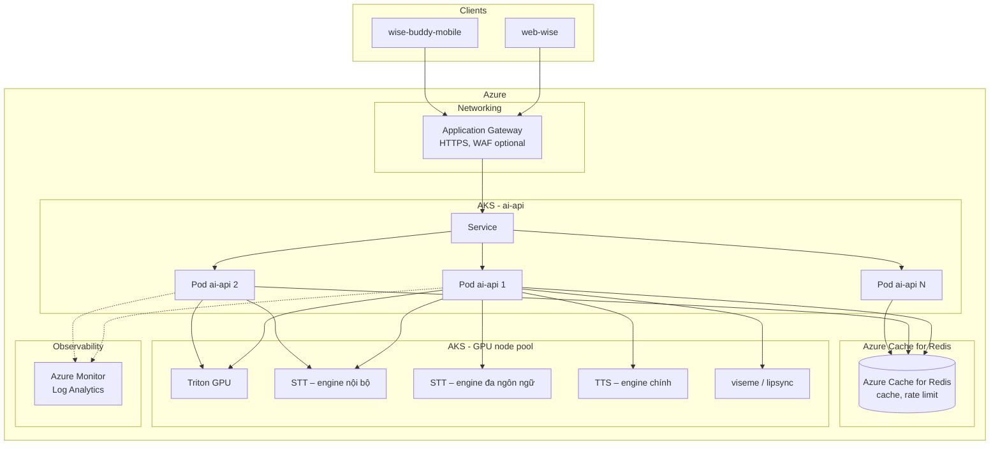

# WISE Platform Architecture – AI-API, Web-WISE, WiseBuddy Mobile

Tài liệu mô tả **kiến trúc thực tế** đã triển khai cho nền tảng WISE: backend AI (ai-api), web app (web-wise), ứng dụng mobile (wise-buddy-mobile). Bao gồm monitoring, Redis cache, Docker container, microservice AI với GPU (Triton + CUDA/TensorRT), và tích hợp client–server.

---

## 1. Tổng quan hệ thống

| Thành phần | Công nghệ | Vai trò |
|------------|-----------|---------|
| **ai-api** | FastAPI, Python 3.11 | Backend AI: orchestration, chat, IELTS (speaking/writing), translation, TTS/STT, grammar, rate limit, cache. |
| **web-wise** | Next.js 15, React 19, TypeScript | Web app: gọi backend (identity/content/payment) và AI API (base URL qua env). |
| **wise-buddy-mobile** | Flutter, Dart, GetX, Dio | Mobile app (Android/iOS): backend + AI API (base URL qua env); SSE streaming, audio, VAD, RevenueCat. |
| **Monitoring stack** | Prometheus, Grafana, Loki, Promtail, cAdvisor, Node Exporter | Thu thập metrics, logs, visualization; ai-api expose /metrics, join monitoring network. |

---

## 2. AI-API – Kiến trúc chi tiết

### 2.1 Tổng quan

- **Framework**: FastAPI, Uvicorn (port 9000).
- **Monitoring**: Prometheus middleware (request count, request duration histogram theo method/endpoint/status); endpoint `/metrics`, `/health`; labels `prometheus.scrape`, `prometheus.port`, `prometheus.path`; kết nối mạng `monitoring` (external) để Prometheus scrape.
- **Redis**: Cache (translation, phonemes, auth token), rate limiter (sliding window), daily limit; async client `redis.asyncio`, TTL cấu hình theo use case (ví dụ 7 ngày cho translation/phonemes).
- **Docker**: Multi-stage Dockerfile (builder + runtime), non-root user, healthcheck; docker-compose gồm `redis` và `fastapi-app`, `depends_on` redis với `condition: service_healthy`.
- **Microservice AI (gọi qua URL)**:
  - **Triton Inference Server**: Wav2Vec2 + TensorRT (CUDA 12.8), GPU; image `nvcr.io/nvidia/tritonserver:25.01-py3`, `deploy.resources.reservations.devices` GPU.
  - STT: hai engine (một nội bộ, một đa ngôn ngữ / tiếng Việt), host/Docker.
  - TTS: engine chính và engine bổ trợ, host/Docker.
  - Service viseme: service riêng cho lipsync.

### 2.2 Kiến trúc AI-API + Redis + Monitoring

### 2.3 Docker Compose (ai-api)

| Service | Image / Build | Port | Ghi chú |
|---------|----------------|------|---------|
| **redis** | redis:7-alpine | 6379 | appendonly, maxmemory 512mb, allkeys-lru; healthcheck redis-cli ping. |
| **fastapi-app** | build từ Dockerfile | 9000 | Biến kết nối cache (vd. `CACHE_URL`); biến URL inference GPU; các biến URL engine (STT/TTS/viseme); networks: ai-network, monitoring; depends_on redis (healthy). |

### 2.4 Monitoring (Prometheus + Grafana stack)

Stack riêng (fastapi-monitoring): Prometheus, Node Exporter, cAdvisor, Loki, Promtail, Grafana. Các service FastAPI (gồm ai-api) expose `/metrics`, labels cho scrape; ai-api join network `monitoring` (external) để Prometheus thu thập metrics.

---

## 3. Microservice AI – Triton với GPU (CUDA)

### 3.1 Triton Inference Server

- **Mục đích**: Serve model Wav2Vec2 tối ưu bằng TensorRT (dynamic batch), latency thấp nhờ GPU.
- **Stack**: NVIDIA Triton 25.01-py3, TensorRT 10.8.0.43, CUDA 12.8, PyTorch (CUDA build).
- **Docker**: `nvcr.io/nvidia/tritonserver:25.01-py3`, mount model repository; `deploy.resources.reservations.devices`: nvidia, count all, capabilities gpu.
- **Ports**: 8000 (HTTP), 8001 (gRPC), 8002 (metrics).
- **Workflow**: Export ONNX → convert sang TensorRT plan (`model.plan`) → đặt vào Triton model repository → chạy Triton; ai-api gọi inference GPU qua URL (ví dụ inference-gpu:8000 trong Docker hoặc host).

### 3.2 Các service AI khác (STT, TTS, viseme)

| Thành phần | Vai trò | Giao thức |
|------------|---------|-----------|
| Engine STT (nội bộ) | STT | HTTP (host/Docker, ví dụ :8005) |
| Engine STT (đa ngôn ngữ) | STT tiếng Việt / đa ngôn ngữ | HTTP (ví dụ :8003) |
| Engine TTS (chính) | TTS | HTTP (ví dụ :8880) |
| Engine TTS (bổ trợ) | TTS | HTTP (ví dụ :5001) |
| Engine TTS (tiếng Việt) | TTS tiếng Việt | HTTP (ví dụ :5003) |
| Service viseme | Lipsync / viseme | HTTP (ví dụ :8006) |

ai-api cấu hình qua biến môi trường (vd. `STT_ENGINE_1_URL`, `STT_ENGINE_2_URL`, `TTS_ENGINE_1_URL`, `VISEME_SERVICE_URL`, …), gọi HTTP tới từng service.

---

## 4. Web-WISE – Frontend

### 4.1 Stack

- **Framework**: Next.js 15, React 19, TypeScript.
- **State / Data**: TanStack React Query, Zustand; Axios cho HTTP.
- **UI**: Tailwind CSS, Radix UI, Framer Motion; Markdown (react-markdown / @uiw/react-markdown-preview).
- **AI/Media**: onnxruntime-web, wawa-lipsync; VAD (@ricky0123/vad-react).

### 4.2 API Endpoints

| Loại | Base URL (env) | Mục đích |
|------|----------------|----------|
| Backend chính | Biến base URL backend (public) / backend.<domain>/api/v1 | Identity, Content, User, Payment. |
| AI APIs | Biến base URL AI API (public) / api.<domain> | TTS, translation, IELTS, roleplay, grammar, debate, speaking practice, … |

Cấu hình tập trung: biến endpoint backend, biến endpoint AI, biến legacy AI base; các module api gọi qua base URL tương ứng.

---

## 5. WiseBuddy Mobile – Flutter

### 5.1 Stack

- **Framework**: Flutter, Dart (SDK ^3.10).
- **State / Navigation**: GetX.
- **Network**: Dio (base API client + AiApiClient với fallback nhiều base URL, refresh token).
- **Storage**: flutter_secure_storage (token).
- **Media**: just_audio, record, audio_waveforms, video_player; VAD (vad); lipsync (assets + shader).
- **Khác**: TanStack Query không dùng; SSE: flutter_client_sse; OAuth: google_sign_in, sign_in_with_apple; RevenueCat: purchases_flutter, purchases_ui_flutter.

### 5.2 API Endpoints

| Loại | Base URL | Mục đích |
|------|----------|----------|
| Backend chính | backend.<domain>/api/v1 | Identity, Content, Payment, Profile, Lessons, … |
| AI APIs | api.<domain>/api (cấu hình base URL AI trong AppConfig / ApiEndpoints) | Roleplay, IELTS, TTS, translation, streaming, … |

AiApiClient có cơ chế fallback nhiều base URL và retry; interceptor auth và refresh token dùng cho backend chính và cho AI API.

---

## 6. Luồng tích hợp tổng thể

---

## 7. Bảng tóm tắt practice đã áp dụng

| Practice | Áp dụng |
|----------|---------|
| **Monitoring** | Prometheus metrics (counter, histogram), /health, /metrics; middleware FastAPI; Docker labels scrape; stack Prometheus + Grafana + Loki + Promtail. |
| **Redis** | Cache translation, phonemes, auth; rate limiter sliding window (Redis sorted set); daily limit; async client, TTL, fail-open khi Redis lỗi (rate limit). |
| **Docker** | Multi-stage build, non-root user, healthcheck; docker-compose với redis + fastapi-app, depends_on healthy; network monitoring external. |
| **Microservice AI** | Tách STT, TTS, Triton (GPU) thành service riêng; gọi qua URL; Triton với CUDA 12.8, TensorRT, GPU reservation. |
| **GPU / CUDA** | Triton Inference Server 25.01, TensorRT 10.8.0.43, Wav2Vec2 TensorRT plan; Docker deploy.resources.reservations.devices nvidia/gpu. |
| **Client** | Next.js (web) và Flutter (mobile) dùng chung backend + ai-api; cấu hình base URL qua env; mobile có fallback base URL và refresh token cho AI API. |

---

## 8. Future: Chuyển lên Azure (hạ tầng)

Hệ thống WISE hiện đang chạy **on-premise** (Docker Compose, Redis, monitoring stack trên server vật lý/VMs). Phần này mô tả kiến trúc **dự định** khi chuyển hạ tầng lên Azure: **AI models giữ nguyên** (Triton, các engine STT/TTS/viseme self-hosted – không dùng Azure AI Speech / Azure OpenAI), chỉ thay đổi nơi chạy và cách scale để xử lý nhiều request.

### 8.1 Nguyên tắc

| Hạng mục | Giữ nguyên | Chuyển sang Azure |
|----------|------------|-------------------|
| **AI models** | Triton (Wav2Vec2 + TensorRT), các engine STT/TTS và service viseme – self-hosted, gọi qua HTTP | Không dùng Azure AI Services (Cognitive Services, OpenAI). Models tiếp tục chạy trong container/VM trên Azure. |
| **Application** | FastAPI (ai-api), logic nghiệp vụ, Redis protocol (cache, rate limit) | Deploy trên Azure (AKS / Container Apps). |
| **Hạ tầng** | — | Compute, network, cache, storage, monitoring dùng Azure services; scale out để handle nhiều request. |

### 8.2 Azure services đề xuất

| Thành phần hiện tại | Azure service | Vai trò |
|---------------------|---------------|---------|
| **ai-api (FastAPI)** | **AKS** (Kubernetes) | Chạy ai-api dưới dạng Deployment; HPA scale theo CPU/request; nhiều replicas phía sau Load Balancer. |
| **Redis** | **Azure Cache for Redis** (Premium hoặc Enterprise) | Thay Redis on-prem: cache, rate limit, daily limit; cluster mode nếu cần throughput cao; persistence, geo-replica tùy chọn. |
| **Triton + STT/TTS/viseme** | **AKS GPU node pool** (NC-series, e.g. NC24ads A100) hoặc **Azure VMs** (NCasT4_v3, NC A100) | Chạy container Triton và các engine STT/TTS/viseme như hiện tại; scale bằng thêm GPU nodes hoặc replica. |
| **Ingress / LB** | **Application Gateway** hoặc **AKS Ingress** (NGINX / Application Gateway Ingress Controller) | HTTPS, SSL termination, routing tới ai-api; optional WAF. |
| **DNS / endpoint** | **Azure DNS** hoặc **Traffic Manager** | Tên miền ai-api (vd. api.<domain>) trỏ tới Application Gateway / LB. |
| **Secrets, config** | **Azure Key Vault** + **AKS CSI driver** hoặc env từ Key Vault | Thay env file: biến kết nối cache, biến URL inference GPU, API keys, certs. |
| **Monitoring** | **Azure Monitor**, **Log Analytics**, **Application Insights** (optional: giữ Prometheus/Grafana trên AKS) | Metrics, logs, alerting; tích hợp với AKS và Azure Cache for Redis. |
| **Optional: API gateway** | **Azure API Management** | Rate limit tập trung, throttling, analytics; có thể bổ sung sau khi traffic lớn. |

### 8.3 Kiến trúc Azure (handle nhiều request)

- **ai-api**: Deployment trên AKS, nhiều replicas; HPA scale theo CPU hoặc custom metrics (request rate); Pods gọi Azure Cache for Redis và các service AI qua internal DNS.
- **Redis**: Azure Cache for Redis (Premium) – cluster hoặc sharding nếu cần; cùng VNet với AKS, giảm latency.
- **AI microservices**: Namespace riêng trên AKS (vd. `ai-ml`); Triton + STT/TTS/viseme chạy trên GPU node pool; có thể dùng KEDA scale GPU workloads theo queue length nếu có queue.
- **Traffic**: Client → Application Gateway (hoặc LB) → Ingress → Service ai-api → nhiều Pods; ai-api → Redis; ai-api → Triton / các engine STT/TTS/viseme (internal).

### 8.4 Cách handle nhiều request trên Azure

| Mục tiêu | Cách làm trên Azure |
|----------|----------------------|
| **Scale ai-api** | AKS Deployment nhiều replicas; HPA (CPU/ memory hoặc custom metrics từ Prometheus/Application Insights); đảm bảo FastAPI stateless, session/cache đưa vào Redis. |
| **Scale Redis** | Azure Cache for Redis Premium: cluster (sharding), tăng throughput; persistence AOF/RDB; đọc từ replica nếu cần. |
| **Scale GPU inference** | AKS GPU node pool: tăng số node hoặc replica Triton/STT/TTS; cân bằng tải qua Service; có thể dùng queue (e.g. Azure Service Bus, Redis queue) + worker để batch request. |
| **Giảm latency** | AKS và Azure Cache for Redis cùng region, cùng VNet; GPU nodes cùng VNet với ai-api; optional Premium SSD cho model storage. |
| **High availability** | AKS multi-replica + PDB; Azure Cache for Redis zone redundancy (Premium); Application Gateway multi-instance; đặt resources across AZs trong region. |
| **Rate limit / protection** | Giữ logic rate limit trong ai-api (Redis) như hiện tại; optional thêm Azure API Management phía trước cho global throttling và DDoS protection (Azure DDoS Protection Standard trên VNet). |

### 8.5 Migration path ngắn gọn

1. **Phase 1**: Đưa ai-api + Redis lên AKS + Azure Cache for Redis; giữ AI microservices on-prem, ai-api gọi về on-prem qua VPN/ExpressRoute hoặc public endpoint tạm.
2. **Phase 2**: Chuyển Triton và các engine STT/TTS/viseme lên AKS GPU node pool (hoặc Azure VMs GPU); cập nhật URL trong ai-api (Key Vault/env).
3. **Phase 3**: Bật HPA, tuning Redis cluster, bổ sung Application Gateway / API Management, Azure Monitor; tắt hạ tầng on-prem khi đã cắt traffic.

---

## 9. Tài liệu tham khảo

- [NVIDIA Triton Inference Server](https://github.com/triton-inference-server/server)
- [TensorRT Documentation](https://docs.nvidia.com/deeplearning/tensorrt/)
- [Prometheus Python Client](https://github.com/prometheus/client_python)
- [FastAPI](https://fastapi.tiangolo.com/)
- [Redis async (redis-py)](https://redis.readthedocs.io/en/stable/examples/asyncio_examples.html)
